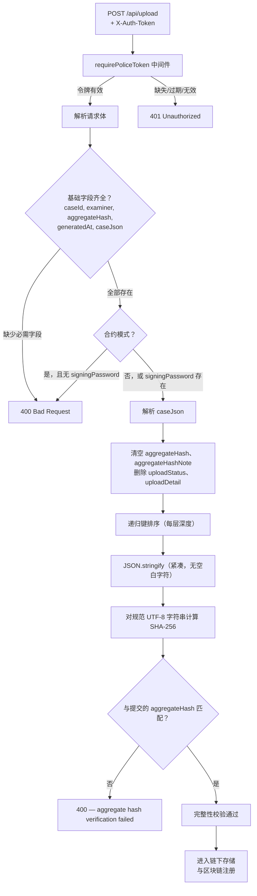

# 4.4.2 上传受理与完整性校验

4.3.5 节描述了 Autopsy 插件如何生成 `case_data_extract.json` 并通过上传配置面板将结构化报告提交至 API 网关。本小节讨论网关在接收到提交请求后的处理逻辑：如何区分提交对象与本地报告，如何在任何链端操作之前独立验证传入数据的完整性，以及该验证闸门产生了哪些结果证据。

网关在此阶段并非被动中转器。它是服务端工作流中第一个对接收到的数据进行独立检查的节点。若提交对象未通过完整性校验或基础请求验证，网关将拒绝该请求，阻止任何链下存储或链上交易的发生。因此，本小节描述的是位于 Autopsy 侧报告生成与后续链下及区块链操作（见 4.4.3、4.4.4 和 4.5 节）之间的验证闸门。

## 本地报告与提交对象的区别

在讨论校验逻辑之前，需要澄清一个容易混淆的问题。Autopsy 插件在案件报告目录下本地保存 `case_data_extract.json`。该文件是 Autopsy 内部产生的主要取证 CoC 产物。然而，网关并非直接接收或打开该本地文件。网关通过 HTTP 接收一个提交对象（submission object），即一个 JSON 请求体，包含多个字段：完整的案件报告字符串（`caseJson`）、案件标识符（`caseId`）、检查员姓名（`examiner`）、生成时间戳（`generatedAt`）以及报告级完整性承诺值（`aggregateHash`）。在合约模式下，提交对象还携带有签名授权凭据（`signingPassword`），且每个请求必须在 `X-Auth-Token` HTTP 头中提供有效的警察一次性令牌。

这一区别不仅在于格式差异。本地文件是一个持久的取证记录，即使上传失败，也依然保留在 Autopsy 案件目录中。提交对象则是一个瞬时传输产物，进入网关后必须通过独立验证，才能产生任何服务端或链端记录。这种分离的实际意义在于：Autopsy 始终保持案件数据的本地视图，而网关仅接受并处理其能够独立确认的数据。

## 请求受理与基础验证

上传端点 `POST /api/upload` 注册在网关的 Express 应用上，由 `requirePoliceToken` 中间件保护。该中间件提取 `X-Auth-Token` 头，在内存令牌存储中查找对应令牌，并在默认配置下于首次成功使用后消费该令牌。若令牌缺失、已过期、已被消费或不匹配任何已签发的令牌，请求将在到达上传处理程序之前被以 HTTP 401 拒绝。这确保只有经过认证的警察提交才能进入验证和存储管线。

令牌认证通过后，上传处理程序对请求体执行基础结构性验证。以下任一条件均会导致立即返回 HTTP 400：

- `caseId` 缺失、为 null 或为空字符串。
- `examiner` 缺失、为 null 或为空字符串。
- `aggregateHash` 缺失、为 null 或为空字符串。
- `generatedAt` 缺失、为 null 或为空字符串。
- `caseJson` 不是非空字符串。

这些检查确保请求携带了后续处理所需的最低限度信息。没有 `caseId`，无法计算索引哈希。没有 `caseJson`，无法验证报告级或记录级完整性。没有 `aggregateHash`，则没有可供比对的承诺值。在最早期点拒绝这些情况可避免浪费计算资源，并防止创建不完整或无引用基准的链下记录。

当网关运行于合约模式（`CHAIN_MODE=contract` 或 `UPLOAD_USE_CASE_REGISTRY=1` 且存在有效的 `CASE_REGISTRY_ADDR`）时，还需附加一项验证：`signingPassword` 必须存在且非空。若缺失，请求在涉及任何链交互之前即被拒绝。理由是合约模式要求网关解密警察用户的 keystore 并以该用户身份签署交易。若缺少签名密码，此步骤无法完成；若仅执行 CRUD 表写入而跳过合约调用，将导致两条链上存储路径处于不一致状态。

**表 4.10 上传入口点的基础请求验证规则**

| 验证条件 | 错误码 | 理由 |
|---|---|---|
| `caseId` 缺失或为空 | 400 | 索引哈希和记录标识所必需 |
| `examiner` 缺失或为空 | 400 | 记录完整性和可问责性所必需 |
| `aggregateHash` 缺失或为空 | 400 | 报告级完整性比对所必需 |
| `generatedAt` 缺失或为空 | 400 | 记录时间上下文所必需 |
| `caseJson` 缺失或非字符串 | 400 | 可验证的证据内容所必需 |
| `X-Auth-Token` 缺失或无效 | 401 | 防止未授权提交 |
| 合约模式下 `signingPassword` 缺失 | 400 | 基于 keystore 的链签名所必需 |

## 完整性校验：网关的独立重算

基础验证通过后，网关进入完整性校验阶段，这是本小节的核心设计组件。该逻辑由 `integrity` 服务模块实现，遵循一项单一原则：网关不信任客户端提交的 `aggregateHash`，而是使用相同的规范 JSON 规则从同一份 `caseJson` 中独立重新计算，并将结果与提交值进行比对。

校验过程遵循以下五个步骤：

1. **解析提交的 `caseJson` 字符串**为 JavaScript 对象。若字符串不是合法的 JSON，请求被拒绝。

2. **准备规范体。** 对解析后的对象进行变换：将 `aggregateHash` 和 `aggregateHashNote` 清空为空字符串，若存在 `uploadStatus` 和 `uploadDetail` 则将其删除。删除 `uploadStatus` 和 `uploadDetail` 的必要性在于，这些字段是在上传成功后追加到本地报告中的，不得影响传输前原始计算的哈希值。

3. **应用递归键排序。** 对每一嵌套深度的每一个对象，以字典序（升序）重新构建其键。数组保持元素顺序，但数组元素内的嵌套对象同样进行键排序。这一步至关重要，因为 JavaScript 的 `JSON.stringify` 保留插入顺序，而不同的 JSON 生成器——包括 Autopsy 插件使用的 Java `Fastjson` 库——即使逻辑内容相同，也可能产生不同的键顺序。键排序消除了键顺序变异作为虚假哈希不匹配的来源。

4. **序列化为紧凑 UTF-8。** 键排序后的对象使用 `JSON.stringify` 序列化，生成无空白字符的输出。不添加任何额外的空格、换行或缩进。这避免了不同序列化器之间的空白字符差异。

5. **计算 SHA-256** 哈希，将小写十六进制摘要与提交中的 `aggregateHash` 进行比对。若两者匹配，则接受该报告为从 Autopsy 完整到达。若两者不一致，网关返回 HTTP 400 及 `"aggregate hash verification failed"` 消息，请求终止，不进行任何后续处理。

该验证闸门的意义在于防止被损坏或被篡改的提交进入链下存储或区块链。若传输错误或蓄意修改导致 `caseJson` 在 Autopsy 计算哈希后发生了内容变化，网关将检测到差异，并在任何服务端状态被创建之前拒绝整笔交易。网关不写入链下记录存储，不插入 CRUD 表，也不调用 CaseRegistry 合约。从 Autopsy 侧唯一可观察到的效果是一条 `UPLOAD_FAILED` 事件，其错误类型指示聚合哈希不匹配，同时本地报告保持完整且未被修改。

该设计还为延至 4.7 节的规范 JSON 讨论建立了清晰边界。在此仅需说明：网关重新计算哈希，该重算遵循与 Autopsy 插件相同的规则，且验证结果决定提交是否继续。详细的规则——键排序、字段排除、Unicode 处理以及验证 Java 与 Node.js 实现之间一致性的跨语言测试——集中放在 4.7 节。

**图 4.5 网关上传受理与完整性校验流程**

## 通过验证后的处理流程

完整性校验通过后，提交进入处理阶段。虽然详细的链端机制属于 4.5 节范畴，但以下顺序在此报告，因为它们构成了网关受理逻辑的直接延续：

1. **计算索引哈希与记录哈希。** 网关使用 `hashOnly` 服务计算 `indexHash = SHA-256(caseId)`。该哈希值在区块链上作为隐私保护的案件查询键。网关同时计算 `recordHash`，即对规范记录对象 `{case_id, case_json, aggregate_hash, examiner, created_at}` 的 SHA-256，代表完整的记录级完整性承诺。两项计算均为确定性：相同输入始终产生相同哈希值，且 Node.js 网关与 Java 区块链模块之间的一致性由跨实现测试夹具和测试用例验证。

2. **保存至链下记录存储。** 完整的案件记录——包括 `caseId`、`caseJson`、`aggregateHash`、`examiner` 和 `generatedAt`——被写入本地记录存储。在当前原型中，该存储是一个 JSON 文件（`~/.case_record_store.json`），将 `caseId` 映射到完整的记录对象。记录存储是链下持久化层。其内容不传输至区块链，完整的 `caseJson` 从不离开私有网关环境。仅有上一步计算的哈希承诺值被注册上链。

3. **插入 CRUD 表。** `{indexHash, recordHash}` 键值对被通过 CRUD 预编译合约插入 FISCO BCOS 的 `t_case_hash` 表。此操作产生 `txHash` 和 `blockNumber`，记录在响应中并合并回本地链下记录。

4. **可选调用 CaseRegistry 合约。** 若合约模式激活，网关使用提供的 `signingPassword` 解密警察用户的 keystore，提取用户私钥，并以签名交易形式调用 `CaseRegistry.createRecord(indexHash, recordHash)`。此步骤产生 `caseRegistryTxHash` 和 `caseRegistryBlockNumber`，同样被记录。

5. **CRUD 与 Registry 路径对账。** 两条写入完成后，网关分别从每条链上路径读取 `recordHash`，若两者不一致，则将 CRUD 副本对齐至 CaseRegistry 值。此对账确保两条链上存储路径不会在后续查询操作中呈现冲突的完整性承诺。

6. **返回回执。** 响应负载包含 `indexHash`、`recordHash`、`txHash`、`blockNumber`，以及在适用情况下的 `caseRegistryTxHash` 和 `caseRegistryBlockNumber`。若计时插桩已启用——由 `X-Debug-Timing: 1` 请求头或 `UPLOAD_TIMING_IN_RESPONSE` 环境变量触发——响应还携带 `requestId` 以及包含 `integrityMs`、`chainMs`、`totalMs` 和 `caseRegistryMs` 的 `timing` 对象。

在 Autopsy 侧，该响应被写入 `upload_receipt.json`，上传状态以 `UPLOAD_OK` 记录在操作日志中。若完整性验收至响应生成之间的任何步骤失败——例如因链不可用、keystore 解密失败或案件重复——链下记录将被移除，错误返回至客户端。这确保失败的提交不会留下不完整或不可验证的链下记录。

**表 4.11 上传受理与完整性校验模块产生的结果证据**

| 证据产物 | 产生位置 | 内容 | 用途 |
|---|---|---|---|
| 完整性校验结果 | 网关，上传期间 | 匹配/不匹配，计算出的哈希值 | 任何存储或链操作之前的闸门决策 |
| 链下记录 | 网关记录存储 | 完整 caseJson、案件元数据、哈希值 | 在私有存储中保留完整案件数据 |
| CRUD 表条目 | FISCO BCOS | indexHash、recordHash、txHash、blockNumber | 链上哈希锚定与基本查询 |
| CaseRegistry 记录 | FISCO BCOS（合约模式） | indexHash、recordHash、txHash、blockNumber | 经智能合约中介的权威记录 |
| 上传响应/回执 | 网关 → Autopsy | 哈希值、交易元数据、计时字段 | Autopsy 侧 upload_receipt.json 及操作日志 |
| 错误响应 | 网关，失败时 | 错误消息、状态码、可选的链端错误 | Autopsy 侧 UPLOAD_FAILED 事件及操作者反馈 |

## 错误边界与优雅降级

上传受理模块包含若干错误边界，保护系统免受部分状态不一致的影响。若 CRUD 表插入成功但随后的记录存储合并失败，链下记录将被移除，确保 CRUD 条目与记录存储不会偏离。若 CRUD 插入成功但 CaseRegistry 调用失败，链下记录同样被移除，错误返回至客户端。若上传后的 CRUD/Registry 对账失败，网关记录警告日志但不上传回滚，因为对账失败本身不表示主上传路径存在问题，仅说明两条链上镜像可能暂时不同步。

这些错误边界是对一项实际问题的认识：上传管线涉及多个独立存储系统——链下 JSON 文件、FISCO BCOS CRUD 预编译合约以及 CaseRegistry 智能合约——各层间的部分成功必须被处理，而非静默接受。当前原型采用回滚并返回作为主要错误恢复策略：若下游步骤失败，上游写入被移除。对研究原型而言，这是一种简单但有效的方法；然而在生产部署中则需增强为分布式事务管理或补偿性操作。该限制将在第五章进一步讨论。

## 与后续章节的关联

本小节将上传受理与完整性校验模块描述为一个验证闸门：它从 Autopsy 接受提交对象，独立验证请求结构和报告级哈希，然后才允许数据进入链下存储和区块链注册。以下关系通向后续章节：

- **4.4.3 节**描述了网关如何将上传概念扩展为修改提案的两方审批工作流，使用相同的完整性校验基础。
- **4.4.4 节**描述了上传路径产生的记录和哈希值如何通过法官仪表盘变得可查询和可审计。
- **4.5 节**提供了详细的区块链侧实现：CRUD 表和 CaseRegistry 合约如何存储哈希承诺、管理提案状态并发出审计事件。
- **4.7 节**整合了支撑此处所述完整性校验的规范 JSON 规则、跨语言哈希一致性以及系统级哈希逻辑。
- **4.9 节**展示了实验结果：成功上传验证、上传计时以及上传受理闸门的功能行为。
- **4.11 节**分析了完整性校验步骤相对于总上传时间的性能开销，为第五章的性能权衡讨论提供了依据。
