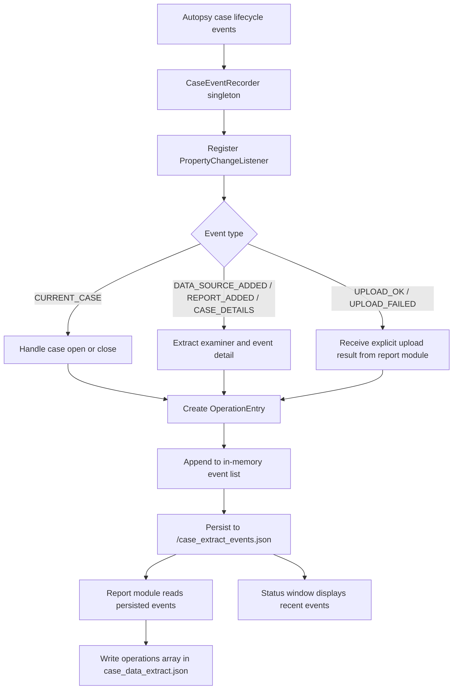
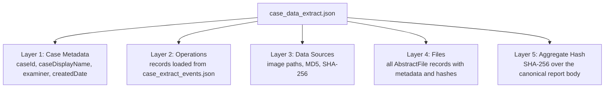
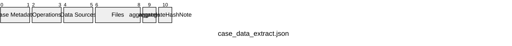
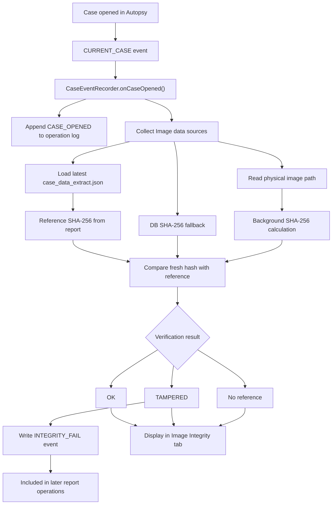
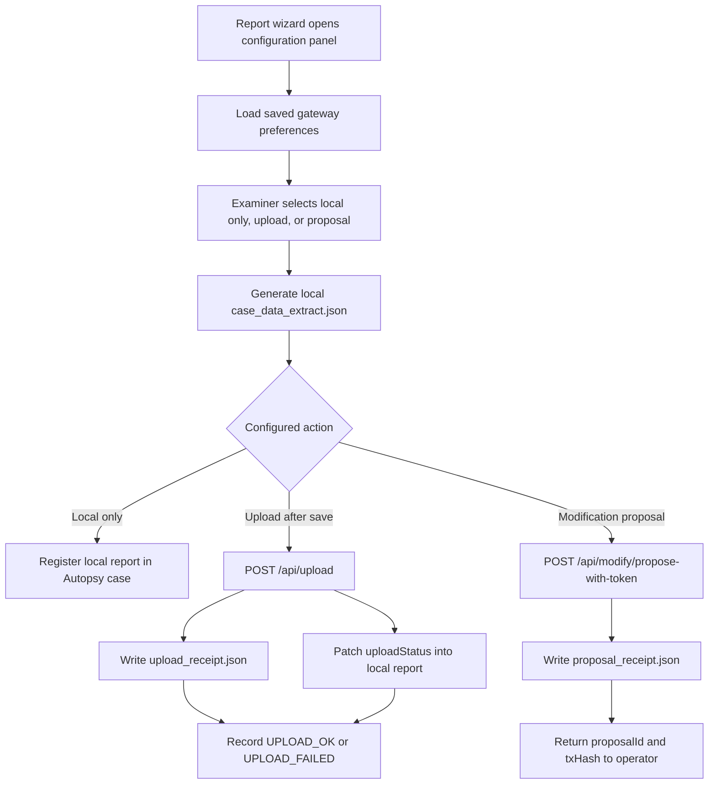

# 4.3 Autopsy 侧实现

本节讨论原型系统在 Autopsy 侧的实现。Autopsy 在本研究中并不是一个外部数据来源，而是数字证据分析、报告生成和证据提交动作发生的主要工作环境。因此，Autopsy 侧实现的核心任务，是将分析阶段产生的案件数据、文件 hash、操作事件和报告输出组织为可验证的 CoC artefact，并使该 artefact 能够进入 gateway 和区块链辅助验证流程。在进入具体功能之前，首先需要说明本研究在 Autopsy 4.22.1 中遇到的插件集成问题。该问题构成了本项目实施过程中最重要的技术发现之一，因为它直接影响原型能否在真实 Autopsy 环境中被加载和运行。

## 4.3.1 Autopsy 集成约束与 Core JAR 补丁部署

本研究最初假定 Autopsy 插件可以通过较常规的 NetBeans Platform 模块机制进行部署。这一假定并非任意选择，而是来自 Autopsy 官方文档对第三方模块开发和安装方式的描述。Autopsy 4.22 用户文档将第三方模块区分为 Java 模块和 Python 模块，其中 Java 模块以 NBM（NetBeans Module）文件发布，并通过 `Tools > Plugins` 中的 plugin manager 安装（The Sleuth Kit, n.d.-a）。Autopsy Java development setup 也说明 Autopsy modules 被封装在 NetBeans modules 中，NetBeans module 会被打包为 `.nbm` 文件，并作为用户安装和自动更新的单位（The Sleuth Kit, n.d.-b）。因此，在研究初期，将 CoC 报告模块、窗口组件和菜单入口封装为 NBM 或独立 module JAR，是符合官方开发 guidance 的实施路线。然而，在 Autopsy 4.22.1 的实际开发过程中，这一路径没有形成稳定可用的部署方式。该问题并非来自 CoC 插件业务逻辑本身，而是来自 Autopsy 发行版对 NetBeans Platform 的定制、裁剪和缓存机制。

首先，标准 NBM 安装路径在安装阶段即暴露出兼容性问题。开发过程中，Autopsy 抛出了 `java.lang.IllegalArgumentException: No enum constant org.netbeans.updater.ModuleInfo.ELEMENTS.licenses`。该异常表明 Autopsy 内置的 `AutoupdateInfoParser` 并不完全等同于标准 NetBeans 发行版中的解析器。标准构建工具生成的 NBM 元数据可能包含 `<licenses>`、`<module-dependencies>` 等 XML 元素，而 Autopsy 4.22.1 中的解析器没有保留这些元素对应的枚举支持。因此，插件包在进入后续模块注册之前就可能被解析器拒绝。对于本研究而言，这说明“Autopsy 基于 NetBeans”并不意味着标准 NetBeans 插件安装路径可以被直接采用。

在 NBM 路径失败之后，研究进一步尝试将编译后的插件 JAR 直接放入 Autopsy 的 `autopsy/modules/` 目录，并手动补充 `config/Modules/` 和 `update_tracking/` 中的模块配置文件，以模拟 NetBeans 模块注册结构。但该方式同样没有稳定生效。Autopsy 启动后，插件模块仍不可见，并出现 `ClassNotFoundException: org.sleuthkit.autopsy.report.caseextract.CaseDataExtractReportModule`。这一结果说明，JAR 文件在物理目录中存在并不等同于该模块已经进入 NetBeans RCP 的内部模块注册表。Autopsy 使用的 `ProxyClassLoader` 只会加载已经被平台识别并记录的模块；如果外部新增 JAR 没有经过完整模块发现和缓存重建过程，其类、服务声明和 UI 注册内容不会被正常解析。

这一失败并不是 Autopsy 个别实现中的偶然现象，而是模块化 Java 平台中类加载器隔离问题的一个具体表现。虽然 NetBeans RCP 与 OSGi 并不是同一套模块系统，但二者都依赖模块边界和 class loader 机制来控制代码可见性。Geoffray et al.（2008）在讨论 OSGi 隔离模型时明确指出，OSGi 为了在不同服务之间提供 isolation，依赖 Java class loading mechanism；他们还指出，OSGi 中的 bundles 是由不同 class loaders 加载的 isolated entities。该文进一步说明，尽管这种架构具有吸引力，其实现仍会受到 JVM class loading 内部机制和属性的限制。由此可见，本研究中 `ProxyClassLoader` 无法发现未完成内部注册的外部 JAR，属于模块化 Java 应用中类加载隔离和可见性边界问题的具体工程化表现。该问题也解释了为什么单纯复制 JAR 文件不能替代平台认可的模块注册过程。

第三个问题来自 NetBeans Platform 的缓存机制。Autopsy 在用户本地缓存目录中维护 `all-manifests.dat`、`all-layers.dat`、`all-resources.dat` 和 `all-checksum.txt` 等二进制缓存，用于加快启动时的模块元数据读取。开发过程中出现过“文件已经替换、配置已经添加，但平台没有任何响应”的现象，其原因在于旧缓存仍然被平台信任和复用。只要缓存校验没有失效，平台就可能继续使用旧的模块状态，而不是重新扫描新加入或被替换的文件。该问题使手动部署尝试更难判断，因为失败并不总是来自代码或注册文件错误，也可能来自缓存未被正确清除。

基于上述失败路径，本研究最终采用 core JAR patch 方式集成 Autopsy 插件。该策略并不是将 core JAR 修改视为一般性最佳实践，而是基于 NetBeans 模块系统机制所作出的版本特定实施选择。NetBeans Modules API 文档说明，NetBeans 通过 manifest 全局部分中的特殊 `OpenIDE-Module` 标记识别一个 module（NetBeans, n.d.）。Oracle NetBeans 文档也说明，module manifest 定义 module 属性，而 XML layer 文件构成运行时 configuration information，并可用于声明菜单、服务和其他 UI 相关对象（Oracle, n.d.）。这意味着，对于 Autopsy 4.22.1 中已经被平台信任和注册的 `org-sleuthkit-autopsy-core.jar` 而言，只要保持其 module manifest 身份并正确合并 layer/service registration，插件类就可以通过已存在的 core module 加载路径进入平台。具体实施中，`build-patch-core.bat` 首先使用 Autopsy 自带 JDK 和模块目录中的依赖 JAR 编译插件 Java 源文件；随后解压原始 `org-sleuthkit-autopsy-core.jar`；再将编译后的 `.class` 文件、资源文件、菜单/窗口相关 layer registration 以及必要的 service registration 注入相应目录；最后使用原始 JAR 中完整的 `MANIFEST.MF` 重新打包为 `patch\org-sleuthkit-autopsy-core-patched.jar`。

在该过程中，保留原始 `MANIFEST.MF` 是一个关键实施细节。早期尝试中，如果使用普通 `jar cf` 方式重新打包，工具会生成仅包含基础 `Manifest-Version` 的最小 manifest，从而覆盖 Autopsy core JAR 原有的 `OpenIDE-Module-*`、`Class-Path` 和 module dependency 声明。结果是 NetBeans Platform 无法再识别核心模块，甚至导致 Autopsy 无法启动，并报告类似 `module named org.sleuthkit.autopsy.core/10 was needed and not found` 的错误。因此，最终构建流程必须显式使用从原始 core JAR 提取出的完整 manifest，以保持 Autopsy 核心模块身份不被破坏。

补丁 JAR 生成后，安装脚本以管理员权限将其替换到 Autopsy 安装目录中的 core JAR 位置，并清理 NetBeans 平台缓存，使下一次启动时能够重建 module metadata。该过程使报告模块、状态窗口、菜单入口和服务注册能够通过 Autopsy 已信任的 core module 路径被加载。换言之，core patch 并不是为了改变插件功能本身，而是为了绕过标准外部模块注册路径在 Autopsy 4.22.1 中暴露出的兼容性限制。

**表 4.4 Autopsy 插件集成方式对比**

| 集成方式 | 预期优势 | 实际限制 | 本研究中的结果 |
|---|---|---|---|
| 标准 NBM 安装 | 符合 NetBeans 插件模型，理论上部署边界清晰 | `AutoupdateInfoParser` 与标准 NBM 元数据不兼容，安装阶段即可能被拒绝 | 未作为最终路径 |
| 直接复制 module JAR | 文件级部署简单，避免 NBM 安装器 | `ProxyClassLoader` 不会自动加载未完成内部注册的外部 JAR，service/layer registration 不可靠 | 不稳定，不采用 |
| 手动补充模块配置与 update tracking | 尝试模拟 NetBeans 模块注册结构 | 仍受平台缓存和内部模块注册表影响，容易出现文件已替换但平台无响应 | 不可靠 |
| Core JAR patch | 通过已受信任的 core module 路径加载类、服务和 UI 注册 | 版本依赖强，部署侵入性较高，需要替换官方 core JAR 并清理缓存 | 被采用为本研究原型部署路径 |

这一实施选择具有双重意义。其一，它保证了本研究所需的 Autopsy 侧功能能够在指定版本中实际运行，从而为后续 CoC 数据捕获、报告生成、image integrity monitoring 和区块链上传提供前提。其二，它揭示了 Autopsy 框架集成可行性本身就是研究结果的一部分。对于区块链 CoC 插件而言，技术可行性不只取决于 hash 计算或链上存储是否能够实现，也取决于插件能否稳定进入取证工具的实际工作流。

同时，core patch 方式也带来明确限制。它依赖 Autopsy 4.22.1 的 core JAR 结构，跨版本升级时需要重新构建和验证；它修改的是 Autopsy 核心模块文件，因而比标准插件安装更具侵入性；它需要保留备份和清理缓存，以避免破坏原始安装环境。软件工程文献对于这种维护风险提供了可解释框架：Parnas（1994）在讨论 software aging 时指出，当软件被反复修改后，后续更新会变得更加昂贵且更容易引入新的错误。因此，本研究不将 core patch 表述为通用生产部署最佳实践，而将其作为在当前 Autopsy 版本和研究条件下经过验证的实施路径。

从数字取证研究的角度看，该问题的解决也回应了既有文献中反复出现的工具适配和证据可信性问题。Garfinkel（2010）指出，数字取证工具必须不断追踪并整合市场中新出现的技术，否则工具会快速过时；同一文章也主张数字取证研究需要更标准化、模块化的数据表示和取证处理方式。Khanji et al.（2022）则指出，当前数字取证工具和方法在面对异构、分布式环境时存在滞后，并且证据采集、保存和分析需要维持可采性。Kent et al.（2006）也将计算机取证描述为在识别、收集、检查和分析数据时保持信息完整性并维持严格 chain of custody 的过程。由此看，本研究解决 Autopsy 插件加载问题的意义不只是“让插件出现于界面中”，而是使完整性验证、操作记录、报告生成和区块链提交能够嵌入既有取证工具工作流之内。该发现将在第五章中进一步用于讨论 Autopsy 框架内链上/链下 CoC 机制的实际集成成本、可维护性、工具适配问题，以及模块化平台类加载隔离对数字取证工具扩展性的影响。

## 4.3.2 Case Event Capture and Operation Log

在 Autopsy 侧实现中，`CaseEventRecorder` 是连接 Autopsy 运行时事件与后续结构化报告的基础模块。该模块的目标不是在报告生成结束后被动推断用户曾经执行过什么操作，而是在 case 生命周期中以事件驱动方式持续捕获关键状态变化。其运行机制可以概括为：插件加载后创建单例 recorder，recorder 向 Autopsy 的 `Case` 事件系统注册 `PropertyChangeListener`，监听与 case 打开、数据源添加、报告生成、case metadata 变化和数据源导入异常有关的事件；每当事件被触发，recorder 将事件时间、事件类型、操作者和事件细节封装为 `OperationEntry`，并立即持久化到当前 case 目录下的 `case_extract_events.json`。随后，在报告模块生成 `case_data_extract.json` 时，报告模块优先从该 case-level event file 读取已保存的操作记录，并写入报告内部的 `operations` array。

**图 4.6 Case Event Capture 模块运行机制**



该设计首先利用了 Autopsy 自身的 case event mechanism，而不是为每一类用户界面操作单独增加拦截逻辑。这样做的合理性在于，CoC 原型真正需要捕获的是会改变证据处理上下文的稳定事件，例如 case 是否被打开、数据源是否进入 case、报告是否生成、case metadata 是否发生变化以及上传是否成功，而不是所有低层级 UI 点击或临时界面状态。事件订阅方式使数据抓取点保持在 Autopsy case model 附近，减少了对界面层的依赖，也降低了因 UI 布局变化导致捕获逻辑失效的风险。

第二，该模块没有将操作记录只保存在内存中。每次事件写入后，`CaseEventRecorder` 都会把完整事件列表重新写入 `case_extract_events.json`。这种即时持久化的设计具有两个实际意义。其一，Autopsy 是一个长时间运行的桌面取证工具，case 分析过程中可能发生关闭、重启或异常退出；如果事件只保存在内存中，运行时故障会直接造成操作上下文丢失。其二，将事件文件放在 case directory 下，使事件记录与 case 本身具有相同的本地归属边界，后续报告生成、完整性检查和上传流程都可以从同一 case context 中恢复这些记录，而不依赖某一次 UI 窗口是否仍然打开。

第三，`CURRENT_CASE` 事件在实现中被单独处理，而不是完全交给通用事件分支。原因在于 case 打开和关闭发生在 Autopsy 内部状态切换过程中，如果在这个阶段直接调用 `Case.getCurrentCaseThrows()`，可能遇到 current case 尚未完全稳定的 race condition。因此，模块在 case open 时直接使用事件对象中的 `Case` instance 读取 case directory、examiner 和 display name；如果插件实例化时 Autopsy 已经自动恢复了上一次打开的 case，recorder 还会主动检查当前 case 并补记一次 `CASE_OPENED`。这一处理保证了自动恢复 case 的场景不会因为错过初始事件而缺少操作日志起点。

第四，上传结果并不完全来自 Autopsy 内置事件，而是由 `CaseDataExtractReportModule` 在 gateway 请求结束后显式写入。成功上传会记录 `UPLOAD_OK`，并在 detail 字段中写入 case ID、table transaction hash、client round-trip time、CaseRegistry transaction hash 和 request ID 等信息；取消或失败则记录 `UPLOAD_FAILED`，并包含 error kind、HTTP status、round-trip time 和面向操作者的错误信息。这一设计使 operation log 不只覆盖 Autopsy 本地 case 行为，也覆盖报告离开 Autopsy、进入 gateway 和 blockchain submission 流程时的关键状态。换言之，事件捕获模块在系统边界上承担了桥接作用：Autopsy 内部事件由 listener 捕获，外部传输结果由报告模块显式回写，二者共同形成后续报告和审计显示所需的 operation history。

**表 4.5 Autopsy 侧捕获的主要操作事件**

| 事件类型 | 触发来源 | 捕获信息 | 设计目的 |
|---|---|---|---|
| `CASE_OPENED` | `CURRENT_CASE` 事件或启动时补记 | Case name、examiner、OS user、timestamp | 建立 case-level operation history 的起点 |
| `CASE_CLOSED` | `CURRENT_CASE` old value | Case name、examiner、timestamp | 在 recorder 清理状态前标记当前 case session 的结束 |
| `ADDING_DATA_SOURCE` | Autopsy data source event | Examiner、data source/import status detail | 记录 data source intake 动作的开始 |
| `DATA_SOURCE_ADDED` | Autopsy data source event | Data source name 或 content detail、examiner、timestamp | 将 evidence intake 与后续 report 和 hash record 关联 |
| `ADDING_DATA_SOURCE_FAILED` | Autopsy data source event | Failure-related detail、examiner | 保存导入失败尝试，以解释报告不完整或后续异常 |
| `REPORT_ADDED` | Autopsy report event | Report-related event detail、examiner | 记录报告生成进入 case history 的时间点 |
| `CASE_DETAILS` | Autopsy case metadata event | Metadata change detail、examiner | 捕获会影响 case-level context 的元数据变化 |
| `UPLOAD_OK` | `CaseDataExtractReportModule` 在 gateway upload 成功后写入 | Case ID、transaction hash、request ID、round-trip time | 连接本地报告生成与外部提交成功状态 |
| `UPLOAD_FAILED` | `CaseDataExtractReportModule` 在 upload 失败或取消后写入 | Error kind、HTTP status、operator message、round-trip time | 保留传输失败尝试，便于后续诊断 |
| `INTEGRITY_FAIL` | `CaseEventRecorder` 内部 image integrity check | Expected/actual hash prefixes、image name | 记录 image file 与 stored reference 之间的 mismatch |

该模块的粒度是 event-level，而不是 instruction-level 或 full UI-interaction-level。也就是说，它能够捕获与 case handling、data source intake、report generation、upload result 和 integrity warning 有关的关键事件，但并不记录每一次文件浏览、每一次表格排序或每一次用户界面点击。对于本研究而言，这一粒度是有意选择的折中：过细的界面级记录会显著增加数据量和隐私暴露面，也可能难以稳定映射为可解释的取证操作；而只在报告生成时记录摘要又会丢失事件发生顺序和失败尝试。当前实现将捕获点放在 case model、report module 和 gateway submission outcome 三个层级，因此能够在较低侵入性的前提下提供可用于后续报告、验证和性能分析的运行时数据。

## 4.3.3 Structured Case Data Report Generation

在完成事件捕获之后，Autopsy 侧的第二个核心实现是结构化 case report 的生成。该模块由 `CaseDataExtractReportModule` 实现，并作为 Autopsy `GeneralReportModule` 注册到 report wizard 中。其功能定位不是替代 Autopsy 原有的普通报告导出，而是生成一份能够被独立验证的证据记录文件。对于本研究而言，报告文件必须同时回应四个取证要求：其一，记录必须覆盖 case 中与分析相关的数据，降低选择性遗漏的风险；其二，记录本身必须能够证明未被事后修改；其三，具备相同工具和输入的第三方应能够重新计算并验证记录内容；其四，记录格式必须机器可读，以便后续 gateway verification、归档、比对和法庭展示。

这一定位与数字取证规范中对完整性和监管链的要求一致。NIST SP 800-86 将计算机取证描述为在识别、收集、检查和分析数据时保持信息完整性并维持严格 chain of custody 的过程；同一指南还强调，若电子日志和记录可能被修改，组织需要能够证明这些记录的完整性（Kent et al., 2006）。Lavín and Llanos（2025）在讨论 ISO 27037 与区块链 CoC 时也指出，CoC 需要通过记录 possession、handling 和 control 来建立数字证据的 authenticity 与 trustworthiness。因此，传统文件列表式导出只能回答“记录了哪些对象”，而本模块要进一步回答“这份记录是否完整、是否能被复算、是否能证明未被篡改”。

**图 4.7 结构化 Case Data Report 的五层内容结构**



第一层是案件元数据。`caseId`、`caseDisplayName`、`examiner` 和 `createdDate` 分别来自 `Case.getNumber()`、`Case.getDisplayName()`、`Case.getExaminer()` 和 `Case.getCreatedDate()`。这些字段由 Autopsy case model 提供，构成报告的身份层。其设计合理性在于，监管链记录必须明确该记录对应哪个案件、由谁负责以及案件在 Autopsy 中的基础时间背景。尤其是 `examiner` 字段，它把结构化报告与具体的取证操作者联系起来，为后续审计、审批和责任追溯提供最小身份上下文。

第二层是操作日志。报告模块并不在生成报告时重新订阅事件，而是读取 case directory 下已经持续积累的 `case_extract_events.json`。这一设计体现了时间维度上的解耦：operation log 是 case 处理过程中不断增长的运行时记录，而 report generation 是某一时间点的快照动作。将该日志纳入 `operations` array 后，操作记录与 case metadata、data sources 和 files 一起受到 `aggregateHash` 保护。如果日志在报告生成后被删除、插入或修改，重算出的聚合哈希将不再匹配。因此，报告不是把审计记录作为外部附件保存，而是使证据内容与操作上下文共存于同一个可验证文件中。

第三层是数据源信息。模块通过 `openCase.getDataSources()` 获取 Autopsy 当前 case 中的数据源；对于 `Image` 类型数据源，进一步提取 `getPaths()` 返回的物理路径，以及 Autopsy 数据库中保存的 `getMd5()` 和 `getSha256()`。这一层记录的是被检验证据的原始身份：路径说明分析对象来自哪个物理镜像文件，Autopsy 保存的 MD5/SHA-256 则提供数据源导入时的 hash reference。需要注意的是，这里的数据源哈希并不是报告生成时重新计算的值，而是 Autopsy 在数据源摄取和 case 数据模型中维护的值。因此，它在本研究中被用作后续 image integrity monitoring 的基准信息，而不是替代后续打开 case 时的重新读取和验证。

第四层是完整文件列表，也是本报告模块最关键的 coverage 设计。实现中，模块优先使用 `SleuthkitCase.findAllFilesWhere("1=1")` 枚举 case 中的全部 `AbstractFile` records，而不是只从 data source root 进行树形遍历。其原因在于，树形遍历依赖文件系统目录关系，可能无法稳定覆盖已删除文件、解除父子链接的目录项或其他不再出现在正常逻辑目录树中的记录。相反，`findAllFilesWhere("1=1")` 直接面向 Sleuth Kit case database 中的 file records，无条件返回查询范围内的全部行，从实现层面降低了因遍历路径受限造成遗漏的风险。若该数据库查询失败，模块才退回到 data source tree traversal 作为备用路径。

**表 4.6 `files` array 中主要字段的取证意义**

| 字段类别 | 具体字段 | 取证意义 |
|---|---|---|
| 身份标识 | `name`, `path` | 唯一定位 case database 中的文件对象 |
| 物理属性 | `size` | 记录文件大小，为截断、填充或异常变化判断提供基础 |
| 时间戳组 | `created`, `modified`, `accessed`, `changed` | 支撑后续 timeline analysis 和事件重建 |
| 存在状态 | `deleted`, `allocated` | 区分正常分配文件、已删除文件和未分配记录 |
| 分类信息 | `known`, `mimeType` | 辅助识别已知文件、未知文件和内容类型 |
| 完整性值 | `md5`, `sha256` | 提供文件内容的数学指纹，用于后续比对和复算 |

这一层的合理性在于，数字取证分析不能只记录调查人员“看见”的文件，而应尽可能记录工具底层 case model 中已经识别出的证据内容。已删除文件往往具有较高调查价值，如果报告生成仅依赖普通目录树，就可能把 Autopsy 数据库中仍然存在、但文件系统视图中不再可见的对象排除在外。采用全量 database query 作为主要路径，使 `files` array 更接近 Autopsy/Sleuth Kit 对证据内容的底层表达，而不是界面视图中的简化文件列表。因此，`files` 在本研究中被定义为 evidence content inventory，而不是普通 export file list。

第五层是聚合哈希。模块在报告主体组装完成后，调用 `CanonicalJson.computeAggregateHash()` 计算 `aggregateHash`，并将结果写回本地 `case_data_extract.json`。在 4.3.3 中，`aggregateHash` 主要作为报告结构中的完整性承诺字段出现，用于说明本地报告并不是普通数据导出，而是一个可被后续模块复算和验证的结构化 artefact。具体的 canonicalisation 规则、self-referential hash 处理方式以及跨模块一致性问题将在 4.6 中作为系统级 hash 逻辑集中讨论。

聚合哈希使报告的五层内容成为一个不可分割的整体。修改任意一个 file hash、删除任意一条 operation record、改变 `examiner` 字段，或在 `files` array 中增加、删除任何对象，都会改变 canonical report body，从而导致重新计算出的 `aggregateHash` 与原值不一致。NIST SP 800-86 对 message digest 的说明指出，改变数据流中的一个 bit 会产生完全不同的 digest；该性质正是本报告模块实现 tamper-evidence 的基础（Kent et al., 2006）。因此，`aggregateHash` 是将报告从普通 JSON 记录提升为具备密码学完整性承诺的取证 artefact 的关键设计。

结构化报告完成后首先被写入本地。具体而言，`CaseDataExtractReportModule` 在 Autopsy report wizard 创建的输出目录下生成 `CaseDataExtract/case_data_extract.json`，并通过 `openCase.addReport(...)` 将该文件注册回当前 Autopsy case。因此，本小节讨论的是本地报告 artefact 的生成和结构，而不是警察端提交或 gateway transmission 的完整流程。该本地 JSON 在后续模块中会作为上传、修改提案和完整性验证的统一输入。

**图 4.8 本地结构化报告的分段结构**



图 4.8 将本地 JSON 报告表示为类似数据包的分段结构。`Case Metadata` 段提供案件身份和 examiner context；`Operations` 段承载从 `case_extract_events.json` 合并而来的操作历史；`Data Sources` 段记录镜像路径和源级 hash reference；`Files` 段保存完整 evidence content inventory；`aggregateHash` 段保存报告主体的完整性承诺；`aggregateHashNote` 段记录本研究使用的哈希计算规则。该图的目的不是展开上传协议，而是说明最终落盘的结构化报告由哪些逻辑段组成，以及这些段如何共同构成后续上传和验证的本地输入。

**表 4.7 `case_data_extract.json` 的主要结构与验证作用**

| JSON section / field | 实现中的数据来源 | 主要内容 | 验证作用 |
|---|---|---|---|
| `caseId` | `Case.getNumber()` | Case number | 标识 gateway submission 和链上 lookup 的 case |
| `caseDisplayName` | `Case.getDisplayName()` | 可读 case name | 提供本地 case context |
| `examiner` | `Case.getExaminer()` | Examiner name | 关联报告与取证操作者 |
| `createdDate` | `Case.getCreatedDate()` | Autopsy 记录的 case creation date | 保存 case-level temporal metadata |
| `operations` | `case_extract_events.json` | Time、action、operator、detail | 将运行时操作历史纳入 hash 保护范围 |
| `dataSources` | `Case.getDataSources()` 和 `Image` API | Source name、paths、MD5、SHA-256 | 保存 evidence source 身份和基准 hash |
| `files` | `SleuthkitCase` 和 `AbstractFile` APIs | 文件元数据、状态、类型和 hashes | 提供完整 evidence content inventory |
| `aggregateHash` | `CanonicalJson.computeAggregateHash()` | Canonical report body 的 SHA-256 | 形成 report-level integrity commitment |

报告选择 UTF-8 JSON，而不是 PDF、CSV 或专有格式，也服务于上述验证目标。JSON 保留了层级结构，能够表达 metadata、operation records、data sources 和 file inventory 之间的关系；同时它是文本格式，便于不同语言和平台解析。与 PDF 相比，JSON 更适合作为 gateway verification 的输入；与 CSV 相比，JSON 更适合表达嵌套数组和对象；与专有格式相比，JSON 降低了第三方复现验证时对特定商业软件的依赖。为了避免 JSON key 顺序和空白字符造成哈希不稳定，本研究没有直接对原始 pretty-printed JSON 字符串求哈希，而是采用 canonical JSON 规则进行规范化。这一点将在 4.6 中进一步展开。

从整体上看，Structured Case Data Report 的设计体现了一个核心理念：报告不仅是取证分析的输出记录，其本身也必须成为可验证的数字证据对象。完整性来自全量 operation log、data source record 和 file inventory；客观性来自 Autopsy/Sleuth Kit Java API，而不是事后手工录入；不可篡改性来自 `aggregateHash` 对全部核心字段的密码学绑定；可验证性来自 JSON 格式、明确的 canonicalisation rule 和跨模块复算机制。这四层要求层层递进，使 `case_data_extract.json` 成为连接 Autopsy 本地分析、gateway integrity verification 和 blockchain hash anchoring 的核心本地 artefact。

需要说明的是，当前实现中的 `generatedAt` 并不是 `case_data_extract.json` 的顶层字段。报告本身记录的是 Autopsy case created date；提交阶段所需的 generation timestamp 会在后续提交模块中处理。因此，4.3.3 只将本地报告界定为后续上传、修改提案和完整性验证的输入，而不展开提交请求的字段结构。

最后，`aggregateHash` 的计算规则虽然在本小节中已经出现在报告结构中，但其跨模块一致性问题将在 4.6 集中讨论。本小节需要强调的是，结构化报告为后续链上/链下协作提供了统一输入：Autopsy 负责生成完整 readable record，gateway 负责重新计算和验证 canonical aggregate hash，blockchain 只保存 hash commitment 和状态数据。由此，报告生成模块成为 Autopsy 分析工作流与区块链验证工作流之间的本地数据边界。

## 4.3.4 Image Integrity Monitoring on Case Open

### 4.3.4.1 功能定位：从一次性哈希记录到持续性完整性验证

数字取证证据效力建立在一个关键前提之上：从证据被发现、获取、分析到最终出庭说明期间，证据内容没有发生未经授权或未被记录的改变。这个前提在实际工作中并不自然成立。镜像文件可能因为存储介质老化而发生 silent data corruption，也可能因为文件移动、备份、操作系统后台进程、误操作或人为篡改而改变。如果取证工具只在数据源导入或报告生成时保存一次 hash value，那么之后每次重新打开 case 时，取证人员仍然需要依赖人工纪律来确认镜像文件是否仍处于可信状态。

传统做法通常是在取证开始前人工计算一次镜像哈希并记录。这一做法对建立初始完整性基准是必要的，但在分析阶段仍有两个缺陷。第一，是否在每次使用前重新验证，完全依赖操作者是否记得执行；第二，即使操作者执行了外部验证，验证结果也未必自动进入案件的操作日志和后续报告。因此，本模块的核心目标是将 image integrity verification 从一次性的人工动作，转化为每次打开 Autopsy case 时自动触发、自动显示、异常自动记录的系统性机制。

这一设计与数字证据处理规范和既有 CoC 研究中的完整性要求相吻合。Giova（2011）指出，digital evidence 具有 complex、diffuse、volatile 的特征，并且可能在获取后被 accidentally or improperly modified，因此 chain of custody 必须保证 collected evidence 能够被 court 接受为 truthful。Cosic and Cosic（2012）也强调，chain of custody 的目的在于证明 evidence has not been altered or changed through all phases；仅知道 evidence 当前位于何处并不足够，还需要 accurate logs tracking evidence material at all time。规范层面上，ENISA first responder guidance 在总结电子证据处理原则时明确将 data integrity 列为首要原则，并指出 digital evidence 的 integrity must be maintained at all stages；同一材料还说明 digital media 容易被修改，因此 documenting a chain of custody 对建立 authenticity 很重要，并且可以使用 hash checksum 展示证据的 integrity and authenticity（ENISA, 2014）。NIST SP 800-101 Rev. 1 也指出，forensic tool 的重要特征之一是维持原始数据源和提取数据的完整性，并强调应通过 cryptographic hash recurrently verifying that this value remains unchanged throughout the lifetime of those files（Ayers et al., 2014）。因此，本模块不是额外的界面功能，而是把“持续性完整性验证”和“验证结果审计绑定”嵌入 Autopsy 工作流的实现。

### 4.3.4.2 模块运行机制

Image Integrity Monitoring 的运行过程可以概括为一个从 case lifecycle event 到 audit event 的闭环。用户在 Autopsy 中打开 case 后，Autopsy 触发 `CURRENT_CASE` 事件，`CaseEventRecorder` 在 `onCaseOpened()` 中首先恢复当前 case 的既有操作日志，并追加 `CASE_OPENED` 记录。随后，模块枚举当前 case 中的 `Image` data sources，读取每个 image 的物理路径，并为其选择 reference hash：系统优先从最新的 `case_data_extract.json` 中读取 data source SHA-256；如果报告不存在或没有可用值，则退回到 Autopsy database 中的 `Image.getSha256()`；如果两者都不存在，则将该 image 标记为 no reference。完成 reference 选择后，模块在后台线程中直接读取物理镜像文件字节并重新计算 SHA-256，再将 fresh hash 与 reference hash 比对。比对结果会显示在 Image Integrity tab 中；如果出现 mismatch，系统会立即追加 `INTEGRITY_FAIL` 事件到 `case_extract_events.json`，使该异常能够在后续 structured report 的 `operations` array 中被记录，并进一步受到 report-level aggregate hash 的保护。因此，该模块不是单纯的 hash 计算工具，而是把“打开案件、重新测量证据、判断完整性、记录异常、纳入后续报告”连接为一个可审计的运行流程。

**图 4.9 Image Integrity Verification 的运行机制**



**表 4.8 Image Integrity Verification 的核心设计决策**

| 设计决策 | 实现方式 | 取证意义 |
|---|---|---|
| 自动触发 | `CURRENT_CASE` event 调用 `startIntegrityCheck()` | 将每次使用前验证变成系统行为 |
| 重新测量物理文件 | `FileInputStream` 读取 image path 并计算 SHA-256 | 避免只信任 Autopsy database 中的既有声明 |
| 报告优先 reference | 优先读取最新 `case_data_extract.json` | 将验证与 CoC artefact 连接 |
| 数据库兜底 | 无报告 reference 时使用 `Image.getSha256()` | 支持首次运行和报告缺失场景 |
| 后台线程 | daemon thread + 64 KB buffer + progress update | 降低大文件 hash 对 UI 的阻塞 |
| 三态输出 | OK / TAMPERED / No reference | 避免把未知状态误判为通过 |
| 异常审计 | mismatch 时写入 `INTEGRITY_FAIL` | 将完整性异常纳入后续报告和审计链路 |

### 4.3.4.3 核心设计决策及其逻辑

**决策 1：验证在每次案件打开时自动触发。**

实现上，`CaseEventRecorder` 订阅 Autopsy 的 `CURRENT_CASE` event。当 `onCaseOpened()` 被调用时，模块会先加载既有 `case_extract_events.json`，追加一条 `CASE_OPENED` 记录，然后立即调用 `startIntegrityCheck()`。这一过程不需要用户点击额外按钮，也不依赖用户在打开案件后手动运行外部 hash 工具。

这个决策体现的是 mandatory compliance 的设计原则：对证据完整性这类关键安全操作，不应完全依赖操作者自觉。将验证嵌入 case open lifecycle，意味着每一次重新进入分析环境都会自动产生完整性检查尝试。它直接回应了现有取证实践中的一个 gap：很多 CoC 记录能够说明证据在某个时间点被接收或移交，却不能保证取证人员每次重新使用镜像前都进行了可记录的完整性确认。自动触发机制把这个人工纪律问题转化为软件工作流问题。

**决策 2：直接读取物理镜像文件字节重新计算 hash，而不是直接信任 API 返回值。**

实现上，模块没有把 `Image.getMd5()` 或 `Image.getSha256()` 作为验证结果本身。相反，`computeFileHash()` 使用 `FileInputStream` 读取 `Image.getPaths()` 指向的 physical image file，并通过 `MessageDigest.getInstance("SHA-256")` 对实际磁盘文件字节重新计算 fresh SHA-256。其基本过程如下：

```text
Physical image file on disk
        ↓ FileInputStream, 64 KB buffer
MessageDigest.update(buffer)
        ↓
Fresh SHA-256 of the physical file
        ↓
Compare with reference hash
```

这是本功能最关键的安全设计。`Image.getSha256()` 返回的是 Autopsy case database 中保存的 hash reference；它适合作为基准值，但不应替代重新验证。原因在于，Autopsy database 本身也位于本地存储中，与镜像文件处于同一工作环境。如果攻击者或误操作同时影响镜像文件和数据库记录，仅调用 API 读取数据库中的 hash 并不能证明物理镜像文件仍未变化。重新读取 physical image bytes 则使验证对象回到被分析证据本身，而不是回到 Autopsy 对该证据的既有记录。这种设计相当于把验证从“读取系统内部声明”转变为“重新测量被验证对象”。

从研究问题角度看，这一点回应了 RQ 1.2 中关于 off-chain storage integrity 的技术可行性问题。区块链只能锚定已经提交的 hash commitment，但 Autopsy 本地镜像文件仍然是链下对象。通过每次 case open 时重新计算物理文件 hash，系统在链上验证之外增加了链下 evidence source 的本地完整性检查，从而减少“链上记录可信，但本地分析对象已经变化”的风险。

**决策 3：参考 hash 来源采用报告优先、数据库兜底。**

实现上，`startIntegrityCheck()` 会先调用 `loadLastReportHashes(caseDirectory)`，在当前 case 的 `Reports` 目录中寻找最近一次生成的 `CaseDataExtract/case_data_extract.json`，并从其中的 `dataSources` array 提取对应 image name 的 SHA-256 作为优先 reference。若报告不存在或没有可用 reference，模块才退回使用 `Image.getSha256()` 从 Autopsy database 中读取的 SHA-256。若二者都不存在，则状态显示为 no reference hash，而不是验证通过。

```text
Reference selection order

1. Latest case_data_extract.json data source SHA-256
        ↓ if unavailable
2. Autopsy database SHA-256 from Image.getSha256()
        ↓ if unavailable
3. No reference hash, first run or no report generated yet
```

报告优先的原因在于，`case_data_extract.json` 是本研究定义的 CoC artefact。它位于 report output 目录下，与 `autopsy.db` 分离，并且其核心内容会受到 report-level `aggregateHash` 保护。相比之下，database hash 是 Autopsy 摄取阶段保存的内部记录，虽然可以作为初始基准，但它与 case database 的其他内容共存。优先使用报告中的 reference，使 image integrity check 与上一节的 structured report 机制形成连续信任链：报告记录数据源 hash，case reopen 时重新测量物理文件，异常则重新进入 operation log，并在下一次报告生成时被纳入聚合哈希保护。

需要准确说明的是，当前实现中的报告 reference 来自 `CaseDataExtractReportModule` 写入 `dataSources` section 的 SHA-256，而该值本身由 Autopsy `Image.getSha256()` 提供。因此，在 raw/dd 镜像中，这一 reference 与 physical image bytes 通常具有直接可比性；但在 E01 等容器格式中，reference hash 的语义需要单独处理。这一点在 4.3.4.4 中进一步说明。

**决策 4：后台线程执行，并提供渐进式进度显示。**

实现上，模块为 image integrity check 创建名为 `CaseDataExtract-IntegrityCheck` 的 daemon thread。线程使用 64 KB buffer 顺序读取物理镜像文件，并在每次读取后更新 `bytesProcessed`。Monitor window 每 2 秒刷新一次，因此取证人员可以看到 `Checking... 23%`、`Checking... 67%`、`OK - integrity verified` 或 `TAMPERED - hash mismatch` 等状态。

后台线程设计具有直接的工程合理性。法证镜像文件可能达到数十 GB 甚至 TB 级，顺序读取并计算 SHA-256 需要明显的 I/O 时间。如果该操作在 UI thread 中执行，Autopsy 界面会在完整性检查期间冻结，影响分析工作，甚至可能被操作系统判断为无响应。后台线程使验证过程与用户界面解耦，既保留自动验证，又避免把安全机制转化为明显的可用性损害。

渐进式进度显示也不仅是用户体验设计，而是 observability 设计。它让取证人员知道系统正在处理大文件，而不是已经失效或卡死。对于本研究的 RQ 2.2 和 RQ 2.3，这一设计也提供了后续性能分析的切入点：image-level SHA-256 重算带来的主要开销不是区块链交易，而是本地顺序 I/O 与哈希计算；因此结果章节应单独记录该功能在不同镜像大小下的耗时，以及后台执行是否足以降低对 Autopsy 操作体验的影响。

**决策 5：验证结论采用三态设计。**

验证完成后，模块不会把所有结果简化为成功或失败，而是使用三种状态表达不同证据意义。

| 状态 | 显示文本 | 取证含义 |
|---|---|---|
| 一致 | `OK - integrity verified` | 物理镜像文件与 reference SHA-256 匹配，可以继续使用该基准进行分析 |
| 不一致 | `TAMPERED - hash mismatch! Image file may have been modified.` | 当前物理文件与参考值不一致，应暂停并调查原因 |
| 无参考 | `No reference hash - first run or no report generated yet` | 系统无法验证，不能把未知状态解释为完整性通过 |

这一三态设计符合取证结论表述的谨慎性。没有 reference 并不等于 evidence intact；它只意味着当前系统缺少足够基准来判断。因此，单独设置 no reference 状态可以避免给取证人员错误安全感。相反，当 hash mismatch 出现时，状态文本直接提示可能存在 tampering。这里使用较强措辞是有意的：在取证工作流中，hash mismatch 不是普通技术差异，而是可能影响证据可靠性的风险事件，应该驱动暂停分析、复核来源、记录异常或上报管理人员等后续动作。

**决策 6：验证失败自动写入操作日志。**

仅在 Monitor tab 中显示警告是不够的，因为界面提示是临时性的，不会自然进入案件历史。当前实现中，一旦 fresh SHA-256 与 reference 不一致，`computeFileHash()` 会调用 `addEvent("INTEGRITY_FAIL", ...)`，向 `case_extract_events.json` 追加 integrity failure 事件。事件 detail 包含 image name、expected hash 前缀与 actual hash 前缀，以便在不占用过多日志空间的情况下保留关键比对线索。

```java
addEvent("INTEGRITY_FAIL", System.getProperty("user.name", ""), detail);
```

这一设计把一次完整性验证失败从“有人在界面上看到一个警告”提升为“系统持久化记录了一次完整性异常”。其后果有三层：第一，事件被写入 case directory 下的 operation log；第二，后续生成 structured report 时，该事件进入 `operations` array；第三，报告的 `aggregateHash` 会覆盖该事件，使其后续修改能够被检测。由此，系统不仅验证镜像文件是否变化，也记录“验证失败这件事本身”。这正是本研究试图回应的现有 gap：传统 CoC 记录经常关注 evidence movement 或 custody transfer，却缺少把运行时完整性检查结果自动纳入可验证审计记录的机制。

### 4.3.4.4 E01 格式的特殊考量与当前边界

E01 等 forensic container 格式需要单独讨论。对于 raw/dd 镜像，物理文件字节与被解析的磁盘镜像内容通常具有直接对应关系，因此 physical file SHA-256 与数据源 reference hash 更容易保持同质比较。对于 E01，情况更复杂：physical E01 file 包含容器头部、压缩、分段和元数据结构，而 Autopsy 数据库中的 image hash 可能表示 logical disk content，而不是容器文件本身。因此，如果直接将 physical container SHA-256 与 logical content SHA-256 比较，就可能得到 format-related mismatch，而不是证据被篡改的结论。

当前实现已经暴露出这一边界：它重新计算 physical image file bytes 的 SHA-256，但报告中的 data source SHA-256 仍来自 Autopsy `Image.getSha256()`。因此，在第四章结果展示中，最稳妥的正向验证证据应使用 raw/dd 镜像；若使用 E01，应明确将其作为格式兼容性测试或 limitation，而不是把 mismatch 简单解释为 tampering。更完整的后续实现应在首次可信运行时专门保存 physical-container SHA-256，并在后续 case open 时与同一语义的 physical-container hash 比较。这样才能满足“比较对象必须同质”的密码学要求。

这一边界本身也具有研究价值。它说明，将 blockchain-based CoC 机制嵌入 Autopsy 时，hash 并不是一个单一概念。系统必须区分 logical content hash、physical container hash、file-level hash、report aggregate hash 和 blockchain record hash。该发现将直接进入 4.6 的 system-wide hash consistency 讨论，并在第五章回应 RQ 1.2 与 RQ 2.3：链上/链下完整性可以被管理，但前提是清楚界定每个 hash 的输入对象和适用范围。

### 4.3.4.5 对研究问题与现有 gap 的回应

该模块主要回应三个层面的研究问题。首先，它回应 RQ 1.2 中关于 Autopsy framework 内管理链上与链下存储完整性的可行性。区块链记录只能保证已经提交的 hash commitment 不被篡改，但 evidence image 仍然保存在本地或机构存储中。Image Integrity Verification 通过 case open 自动重算 physical file hash，为链下 evidence source 增加了一道可操作的完整性检查。

其次，它回应 RQ 1.3 中关于 runtime data collection 的问题。该模块能够在运行时自动获得 case open event、image name、physical path、computed SHA-256、reference SHA-256、verification status 和 failure event。其粒度不是文件系统内部每个 extracted file，而是 image data source level；这与 4.3.3 的 full file inventory 形成互补：4.3.3 记录镜像内部文件状态，4.3.4 验证承载这些文件记录的底层镜像文件是否仍然可信。

第三，它为 RQ 2.2 和 RQ 2.3 的性能讨论提供了实现基础。该安全机制的主要开销来自读取大体量 image file 和计算 SHA-256，而不是链上传输本身。后台线程和进度显示是本研究对该开销的最小化策略，但它是否足够有效仍需要在 4.10 的 performance results 中通过不同镜像大小、计算耗时和 UI 可用性观察来验证。

从现有 gap 的角度看，该模块补足的是“验证行为本身缺少自动化和审计绑定”的问题。传统 CoC 记录可以证明某个 hash 曾经被记录，区块链方案可以证明某个 hash commitment 之后没有被修改，但二者都不必然保证每次重新打开案件前都进行了实际验证。本模块把验证行为嵌入 Autopsy case lifecycle，并把失败结果写入 operation log，再通过 structured report 和 aggregate hash 进入后续 CoC artefact。由此，系统形成了一个更完整的技术链条：不仅证据镜像被验证，验证行为及其异常结论也被记录、报告和保护。

## 4.3.5 Upload and Proposal Configuration in Autopsy

在前述模块中，Autopsy 已经能够生成本地 `case_data_extract.json`，并在 case 打开时执行 image integrity monitoring。接下来需要解决的问题是：本地报告如何在不破坏 Autopsy 工作流的前提下进入 gateway 与区块链流程。为此，本研究没有在 Autopsy 插件中直接嵌入区块链节点 SDK 或智能合约调用逻辑，而是在 Autopsy report wizard 中实现一个 upload/proposal configuration layer。该层的作用是让取证人员在生成报告的同一操作流程中选择后续动作，并把提交所需的最小参数交给 gateway 处理。换言之，Autopsy 侧负责生成、配置和发起请求；gateway 侧负责重新验证、身份检查、合约调用和链上状态更新。

这一设计的出发点是保持取证操作的场景连续性。警察或取证人员完成分析后，最自然的动作是在 Autopsy 内部生成报告并提交，而不是先导出文件、切换到外部命令行工具、手工复制 case ID、hash 和 token 后再提交。将操作入口放在 Autopsy report wizard 中，可以把“报告生成”和“证据提交”连接成一个连续的人机交互过程，减少手工转录字段带来的错误风险，也使上传成功、失败、取消和修改提案结果能够被立即写回同一个 case context。这对于真实数字法学场景尤其重要：取证工具不只是数据抽取工具，也是操作者形成证据记录和监管链行为的工作场所。

### 4.3.5.1 配置界面的功能定位

配置界面由 `UploadSettingsPanel` 实现，并作为 `CaseDataExtractReportModule` 的 configuration panel 显示在 Autopsy report wizard 中。该界面提供六类输入或控制：gateway base URL、`Upload after save`、`Submit as modification proposal`、proposal reason、`Request upload timing`、one-time token 和 signing password。其设计不是为了暴露所有 gateway 或 blockchain 参数，而是把 Autopsy 操作者需要决策的内容限制在提交行为本身：报告是否只保存在本地、是否在保存后立即初始提交、是否作为已存在案件的修改提案提交，以及本次请求使用何种授权凭据。

**表 4.9 Autopsy 上传与修改提案配置项**

| 配置项 | 实现字段或控件 | 设计作用 |
|---|---|---|
| Gateway Base URL | `gatewayUrlField` | 指定 Autopsy 与 gateway 交互的 HTTP 入口 |
| Upload after save | `uploadAfterSaveCheck` | 在本地报告生成后执行初始 evidence submission |
| Submit as modification proposal | `proposalEnabledCheck` | 对已上链案件提交修改提案，而不是覆盖既有记录 |
| Reason | `proposalReasonArea` | 为修改提案提供人工可解释理由 |
| Request upload timing | `uploadTimingCheck` | 请求 gateway 返回性能测量字段，用于后续实验结果 |
| Token | `otpField` | 传递 police OTP / `X-Auth-Token`，用于 gateway 授权 |
| Signing password | `signingPasswordField` | 提供合约签名账户所需密码，由 gateway 执行链上提交 |

其中最重要的设计是 `Upload after save` 与 `Submit as modification proposal` 被实现为互斥选项。初始提交与修改提案在数字证据监管链中的法律含义不同：前者表示将一个尚未进入链上登记的 case report 作为初始记录提交；后者表示针对已存在的链上 case record 发起变更请求，后续需要审批或智能合约状态转换。若两者允许同时启用，系统将无法判断用户意图，也可能导致同一份报告既被视为新证据提交，又被视为对旧证据的修改。因此，`UploadSettingsPanel` 在一个选项被选中时自动取消另一个选项，使用户必须在“initial submission”和“modification proposal”之间明确选择。

### 4.3.5.2 模块运行机制

该模块的运行机制可以分为配置保存、报告生成后分流、HTTP 请求执行和结果回写四个阶段。首先，report wizard 打开配置面板时，`CaseDataExtractUploadPreferences.applyTo()` 会把上次保存的 gateway URL、upload/proposal toggles、contract mode 和 timing 选项加载到 `CaseDataExtractReportModuleSettings` 中；用户修改配置后，`saveTo()` 会把界面状态写回 settings。需要注意的是，gateway URL、toggle 和 timing 选项会通过 NetBeans `NbPreferences` 持久化，但 one-time token、signing password 和 proposal reason 不会写入长期 preferences。这样既保留了常用连接配置，又避免把临时授权凭据和本次提案理由作为长期本地配置保存。

其次，`CaseDataExtractReportModule.generateReport()` 总是先完成本地报告生成，并将 `case_data_extract.json` 写入 `CaseDataExtract/` 输出目录。只有在本地报告已经落盘并通过 `openCase.addReport(...)` 注册回 Autopsy case 之后，模块才根据配置执行后续分流：如果 `proposalEnabled` 为 true，则调用 `maybeProposeReportJson()`；如果 `uploadEnabled` 为 true，则调用 `maybeUploadReportJson()`；如果二者都未启用，则流程停留在本地报告生成。这一顺序保证了链上/网关提交不是报告生成的前置条件。即使 gateway 不可用，Autopsy 仍然能够保留本地结构化报告。

第三，请求由 `GatewayClient` 统一执行。初始提交调用 `POST /api/upload`，修改提案调用 `POST /api/modify/propose-with-token`，连接测试调用 `GET /health`。请求体由 `UploadRequest` 生成，核心字段包括 `caseId`、`examiner`、`aggregateHash`、`generatedAt` 和完整 `caseJson`；修改提案会额外加入 `reason`，并要求 signing password。授权 token 不写入请求体，而是通过 HTTP header `X-Auth-Token` 传递。这样的字段划分使 gateway 可以在接收后重新计算报告 hash、检查 token、验证签名凭据，并决定是否执行初始登记或修改提案。

**图 4.10 Autopsy 上传与修改提案配置流程**



### 4.3.5.3 初始提交配置的设计合理性

初始提交路径由 `Upload after save` 触发。该路径适用于案件报告首次进入链上登记的场景。实现中，模块在生成本地 JSON 后创建 `UploadRequest`，将 `caseId`、`examiner`、`aggregateHash`、`generatedAt` 和完整 `caseJson` 发送到 gateway。gateway 成功返回后，Autopsy 插件会写入 `upload_receipt.json`，其中包含 `uploadStatus`、`uploadStartedAt`、`uploadResponseAt`、`clientRoundTripMs`、`indexHash`、`recordHash`、`txHash`、`blockNumber`，以及在 CaseRegistry 成功写入时返回的 `caseRegistryTxHash` 和 `caseRegistryBlockNumber`。同时，`ReportUploadStatusPatcher` 会把 `uploadStatus` 与 `uploadDetail` 追加到本地 `case_data_extract.json`，使本地报告能够反映其外部提交结果。

将初始提交入口放在 Autopsy 内部有两个关键好处。第一，提交请求使用的是刚刚生成的报告内容和同一运行上下文中的 `aggregateHash`，降低了用户手动选择错误文件或复制错误 hash 的风险。第二，提交结果可以立即被写回 operation log：成功时记录 `UPLOAD_OK`，包含 case ID、table transaction hash、client round-trip time、CaseRegistry transaction hash 和 request ID；失败或取消时记录 `UPLOAD_FAILED`，包含 error kind、HTTP status、round-trip time 和面向操作者的错误说明。由此，提交行为本身成为 case operation history 的一部分，而不是独立于 Autopsy 的外部操作。

### 4.3.5.4 修改提案配置的设计合理性

修改提案路径由 `Submit as modification proposal` 触发。该路径服务于一个更接近真实监管链的场景：证据记录已经进入链上登记后，取证人员不应直接覆盖既有记录，而应提交带有理由的修改提案，并交由后续审批流程处理。因此，界面要求用户填写 reason，并提供 token 与 signing password。实现中，`maybeProposeReportJson()` 会检查 gateway URL、token、case ID、signing password 和 reason 是否存在；只有这些条件满足时，才向 `POST /api/modify/propose-with-token` 发送请求。

该设计在管理意义上将“修改”与“新增”明确区分。初始提交回答的是“这份 case report 是否可以进入监管链”；修改提案回答的是“已登记记录是否存在需要被审查的变更”。技术上，proposal response 会返回 `proposalId`、`txHash`、`blockNumber`、`indexHash`、`oldRecordHash`、`newRecordHash` 和 `pendingKey` 等字段，并写入 `proposal_receipt.json`。这些字段为后续审批流提供定位依据：审批者可以根据 proposal ID 和 hash 差异判断本次修改对应哪个案件、改变了哪个 record commitment，以及该提案是否已经进入链上 pending 状态。

因此，修改提案配置不只是一个额外上传按钮，而是把 Autopsy 端的报告生成行为接入智能合约驱动的变更控制过程。它避免了“取证人员本地重新生成报告后直接覆盖链上记录”的风险，使证据记录的变更必须通过可追踪、可审批、可执行的 proposal path。这一点将在后续审批流和智能合约模块中进一步展开。

### 4.3.5.5 验证、错误处理与性能数据收集

该模块还承担了基础验证和实验数据收集功能。配置界面对 gateway URL 使用正则表达式进行早期校验；当 URL 不合法时，upload/proposal 选项会被自动撤销，并在界面上给出错误提示。`Test Connection` 按钮通过 `GatewayClient.ping()` 请求 `/health`，并显示 gateway 是否可达以及往返延迟。该连接测试并不证明区块链交易一定成功，但可以在报告生成之前排除最基本的网络配置错误。

错误处理方面，上传路径会区分 token missing、invalid URL、missing case ID、timeout、gateway unreachable、duplicate case、payload too large、chain unavailable、aggregate mismatch、forbidden 和 signing password error 等情况，并将这些错误转化为操作者可理解的状态文本。若用户在上传过程中取消 report generation，模块会通过 cancel watcher 断开 `HttpURLConnection`，写入 cancelled receipt，并把 `UPLOAD_FAILED` 以 `errorKind=CANCELLED` 的形式加入操作日志。这种处理使失败状态不被静默丢弃，也避免用户误以为本地报告生成成功就意味着链上提交成功。

性能数据方面，`Request upload timing` 会使请求带上 `X-Debug-Timing: 1`，gateway 可返回 `integrityMs`、`chainMs`、`caseRegistryMs` 和 `totalMs`。Autopsy 侧同时使用 `UploadClientTiming` 记录 `uploadStartedAt`、`uploadResponseAt` 和 `clientRoundTripMs`。因此，本模块为第四章结果部分提供了可直接使用的 evidence：客户端 round-trip time 可以衡量 Autopsy 到 gateway 的整体等待时间，gateway timing 可以分解 integrity verification、chain submission 和 CaseRegistry 写入的开销。这与 RQ 2.1、RQ 2.2 和 RQ 2.3 直接相关，因为它使数据传输、链下验证和链上交互的性能成本能够被分开观察，而不是只得到一个模糊的“上传耗时”。

整体而言，Upload and Proposal Configuration 模块在 Autopsy 内部建立了本地报告与外部 CoC infrastructure 之间的操作边界。它不把区块链复杂性暴露给取证人员，而是通过受控配置、互斥路径、授权 token、签名密码、receipt 文件和 operation log，把初始提交与修改提案纳入同一个可审计工作流。该模块也为后续章节讨论 gateway 验证、智能合约审批和性能 trade-off 提供了必要的 Autopsy 侧入口。

## 参考文献

Ayers, R., Brothers, S., & Jansen, W. (2014). *Guidelines on mobile device forensics* (NIST Special Publication 800-101 Revision 1). National Institute of Standards and Technology. https://doi.org/10.6028/NIST.SP.800-101r1

Cosic, J., & Cosic, Z. (2012). Chain of custody and life cycle of digital evidence. *Computer Technology and Application, 3*, 126-129.

ENISA. (2014). *Electronic evidence: A basic guide for first responders*. European Union Agency for Network and Information Security. https://doi.org/10.2824/068545

Garfinkel, S. L. (2010). Digital forensics research: The next 10 years. *Digital Investigation, 7*, S64-S73. https://doi.org/10.1016/j.diin.2010.05.009

Geoffray, N., Thomas, G., Clément, C., & Folliot, B. (2008). Towards a new isolation abstraction for OSGi. In *Proceedings of the 1st Workshop on Isolation and Integration in Embedded Systems (IIES '08)*. ACM.

Giova, G. (2011). Improving chain of custody in forensic investigation of electronic digital systems. *International Journal of Computer Science and Network Security, 11*(1), 1-9.

Kent, K., Chevalier, S., Grance, T., & Dang, H. (2006). *Guide to integrating forensic techniques into incident response* (NIST Special Publication 800-86). National Institute of Standards and Technology.

Khanji, S., Alfandi, O., Ahmad, L., Kakkengal, L., & Al-kfairy, M. (2022). A systematic analysis on the readiness of blockchain integration in IoT forensics. *Forensic Science International: Digital Investigation, 42-43*, Article 301472. https://doi.org/10.1016/j.fsidi.2022.301472

Lavín, I., & Llanos, D. R. (2025). *An analysis of blockchain solutions for digital evidence chain of custody*.

NetBeans. (n.d.). *Modules API*. Retrieved April 28, 2026, from https://bits.netbeans.org/9.0/javadoc/org-openide-modules/org/openide/modules/doc-files/api.html

Oracle. (n.d.). *Working with NetBeans modules*. Retrieved April 28, 2026, from https://docs.oracle.com/netbeans/nb81/netbeans/develop/nbeans_modules.htm

Parnas, D. L. (1994). Software aging. In *Proceedings of the 16th International Conference on Software Engineering* (pp. 279-287). IEEE Computer Society Press.

The Sleuth Kit. (n.d.-a). *Autopsy user documentation 4.22.0: Installing 3rd-party modules*. Retrieved April 28, 2026, from https://sleuthkit.org/autopsy/docs/user-docs/4.22.0/module_install_page.html

The Sleuth Kit. (n.d.-b). *Autopsy: Java development setup*. Retrieved April 28, 2026, from https://www.sleuthkit.org/autopsy/docs/api-docs/4.9.0/mod_dev_page.html
