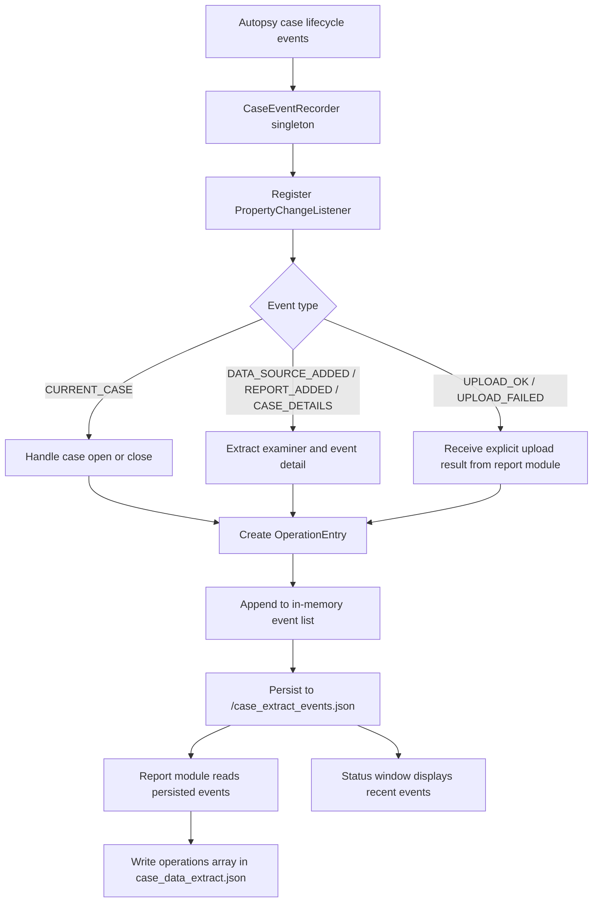
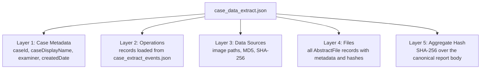
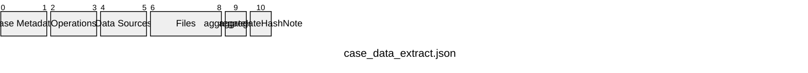
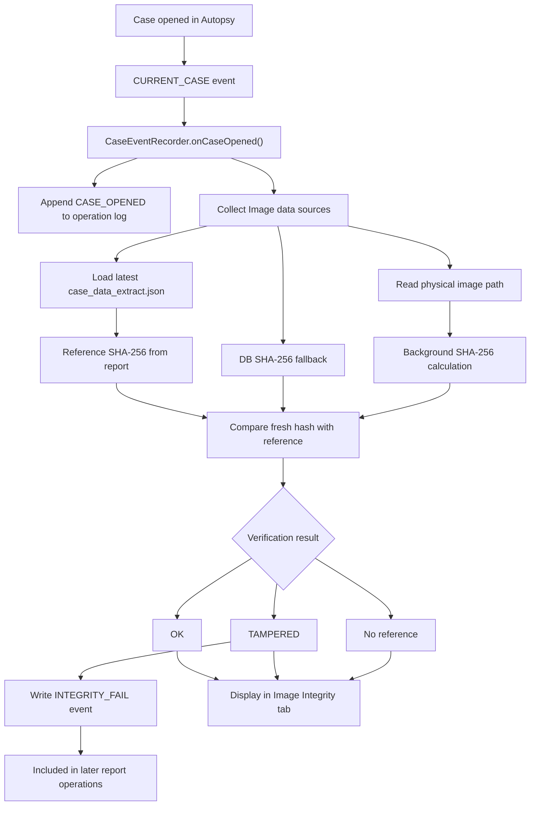
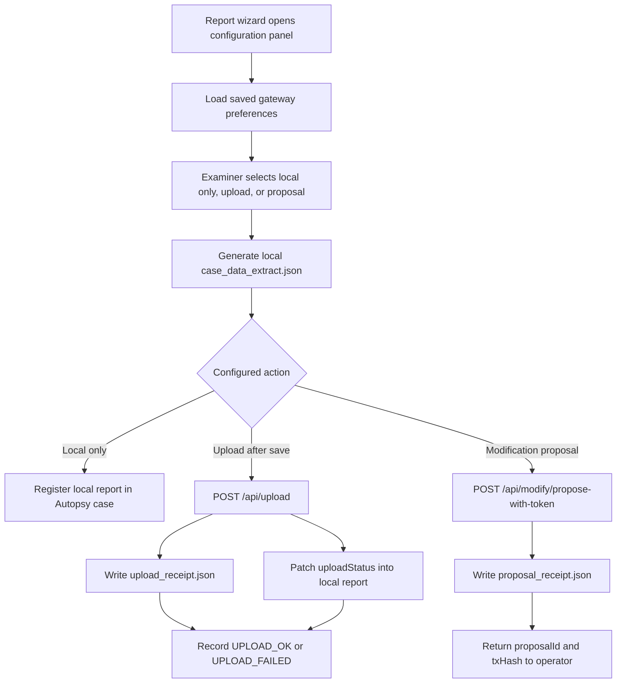

# 4.3 Autopsy-Side Implementation

This section presents the Autopsy-side implementation of the prototype. In this study, Autopsy is not treated merely as an external source of data. It is the primary environment in which digital evidence is analysed, reports are generated, and evidence submission actions are initiated. The purpose of the Autopsy-side implementation is therefore to organise case data, file hashes, operation events, and report output into a verifiable CoC artefact that can enter the gateway and blockchain-assisted verification workflow. Before discussing the functional modules, it is necessary to report the plugin integration problem encountered in Autopsy 4.22.1. This became one of the most important implementation findings of the project because it directly affected whether the prototype could be loaded and executed inside a real Autopsy environment.

## 4.3.1 Autopsy Integration Constraint and Core JAR Patch Deployment

The initial assumption of this study was that the Autopsy plugin could be deployed through a conventional NetBeans Platform module mechanism. This assumption did not arise arbitrarily; it followed the official guidance for Autopsy third-party module development and installation. The Autopsy 4.22 user documentation distinguishes between Java modules and Python modules, describing Java modules as being shipped in NBM (NetBeans Module) files and installed through the plugin manager under `Tools > Plugins` (The Sleuth Kit, n.d.-a). The Autopsy Java development setup documentation similarly states that Autopsy modules are encapsulated inside NetBeans modules, that a NetBeans module is packaged as a `.nbm` file, and that this NetBeans module is what the user installs and updates (The Sleuth Kit, n.d.-b). It was therefore reasonable at the beginning of the study to package the CoC report module, window component, and menu entry as an NBM or independent module JAR and to rely on the platform's module discovery, service registration, and layer registration mechanisms. However, during implementation on Autopsy 4.22.1, this route did not provide a stable deployment method. The problem was not caused by the CoC plugin logic itself, but by the way the Autopsy distribution customises, trims, and caches parts of the NetBeans Platform.

The first issue appeared during the standard NBM installation attempt. Autopsy raised the exception `java.lang.IllegalArgumentException: No enum constant org.netbeans.updater.ModuleInfo.ELEMENTS.licenses`. This indicates that the `AutoupdateInfoParser` embedded in Autopsy is not equivalent to the parser in a standard NetBeans distribution. NBM metadata generated by standard build tools may include XML elements such as `<licenses>` and `<module-dependencies>`, while the parser shipped with Autopsy 4.22.1 does not retain enumeration support for these elements. As a result, the plugin package can be rejected at the parsing stage before it reaches the later module registration process. For this research, the finding is important because it shows that the statement "Autopsy is based on NetBeans" does not mean that the standard NetBeans plugin installation route can be adopted without verification.

After the NBM route failed, the study attempted a second integration strategy: copying the compiled plugin JAR directly into Autopsy's `autopsy/modules/` directory and manually adding module configuration files under `config/Modules/` and `update_tracking/` to simulate the NetBeans module registration structure. This approach also failed to produce stable loading. After Autopsy started, the plugin remained invisible, and the logs showed `ClassNotFoundException: org.sleuthkit.autopsy.report.caseextract.CaseDataExtractReportModule`. This demonstrated that the physical presence of a JAR file in the module directory is not equivalent to successful registration in the internal module registry of NetBeans RCP. The `ProxyClassLoader` used by Autopsy loads only modules that have already been recognised and recorded by the platform. If an externally added JAR has not passed through the complete discovery and cache-rebuild process, its classes, service declarations, and UI registrations are not reliably resolved.

This failure was not merely an accidental behaviour of Autopsy; it is a concrete instance of a wider class-loader isolation issue in modular Java platforms. Although NetBeans RCP and OSGi are not the same module system, both rely on module boundaries and class loader mechanisms to control code visibility. Geoffray et al. (2008), when discussing the OSGi isolation model, state that OSGi relies on the Java class loading mechanism to provide isolation between services. They also state that OSGi bundles are isolated entities loaded by different class loaders. The same paper further notes that, although the architecture is attractive, the implementation has limits due to the internal mechanisms and properties of class loading in the JVM. In this sense, the inability of Autopsy's `ProxyClassLoader` to resolve an externally added JAR that had not completed internal registration is a specific engineering manifestation of class-loader isolation and visibility boundaries in modular Java applications. This explains why simply copying a JAR file could not replace platform-recognised module registration.

The third issue was caused by the NetBeans Platform cache mechanism. Autopsy maintains binary metadata caches such as `all-manifests.dat`, `all-layers.dat`, `all-resources.dat`, and `all-checksum.txt` in the local user cache directory to speed up module metadata loading during startup. During development, this produced the misleading situation in which files had been replaced and configuration entries had been added, but the platform appeared to have no response. The reason was that the old cache was still trusted and reused. If the cache checksum did not force invalidation, the platform could continue restoring the previous module state instead of rescanning newly added or replaced files. This made manual deployment failures difficult to interpret, because the failure could result not only from code or registration errors, but also from stale platform metadata.

Based on these failed paths, the study ultimately adopted a core JAR patch strategy to integrate the Autopsy plugin. This strategy should not be interpreted as treating modification of the core JAR as a general best practice. Rather, it was a version-specific implementation choice grounded in the mechanics of the NetBeans module system. The NetBeans Modules API explains that a module is recognised by a special `OpenIDE-Module` tag in the global section of the manifest (NetBeans, n.d.). Oracle's NetBeans documentation also describes the module manifest as defining module attributes, while XML layer files define runtime configuration information used for menus, services, and UI-related objects (Oracle, n.d.). Therefore, for `org-sleuthkit-autopsy-core.jar`, which was already trusted and registered by Autopsy 4.22.1, preserving the module manifest and correctly merging layer/service registrations provided a practical route for loading the plugin through the existing core module path. In implementation, `build-patch-core.bat` first compiles the plugin Java source files using Autopsy's bundled JDK and the dependency JARs in the Autopsy module directory. It then extracts the original `org-sleuthkit-autopsy-core.jar`, injects the compiled `.class` files, resources, menu/window layer registrations, and required service registrations into the corresponding locations, and finally repackages the result as `patch\org-sleuthkit-autopsy-core-patched.jar`.

Preserving the original `MANIFEST.MF` was a critical implementation detail. In an early attempt, repackaging the JAR with a simple `jar cf` command caused the tool to generate a minimal manifest containing only the basic `Manifest-Version` field. This overwrote the original Autopsy core JAR manifest, including its `OpenIDE-Module-*`, `Class-Path`, and module dependency declarations. The result was that the NetBeans Platform could no longer recognise the core module, and Autopsy failed to start with an error similar to `module named org.sleuthkit.autopsy.core/10 was needed and not found`. The final build process therefore explicitly uses the complete manifest extracted from the original core JAR so that the identity of the Autopsy core module is preserved.

After the patched JAR is generated, the installation script replaces the original core JAR in the Autopsy installation directory with administrator privileges and clears the NetBeans platform cache so that module metadata can be rebuilt on the next startup. This allows the report module, status window, menu entry, and service registration to be loaded through the already trusted core module path. In other words, the core patch does not change the forensic logic of the plugin; it provides a practical route around the compatibility limitations exposed by the external module registration path in Autopsy 4.22.1.

**Table 4.4 Comparison of Autopsy Plugin Integration Approaches**

| Integration approach | Expected advantage | Observed limitation | Outcome in this study |
|---|---|---|---|
| Standard NBM installation | Aligns with the NetBeans plugin model and has a clear deployment boundary | `AutoupdateInfoParser` was incompatible with standard NBM metadata and could reject the module during installation | Not used as the final path |
| Copying the module JAR directly | Simple file-level deployment that avoids the NBM installer | `ProxyClassLoader` did not automatically load an external JAR without internal registration; service/layer registration remained unreliable | Unstable and not adopted |
| Manually adding module configuration and update tracking | Attempts to reproduce the NetBeans module registration structure | Still affected by platform caches and the internal module registry; file changes could be ignored | Not reliable |
| Core JAR patch | Classes, services, and UI registrations are loaded through the already trusted core module path | Version-dependent and more intrusive; requires replacing the official core JAR and clearing caches | Adopted as the prototype deployment path |

This implementation choice has two implications. First, it made the Autopsy-side functions required by this study executable in the target version, providing the prerequisite for CoC data capture, report generation, image integrity monitoring, and blockchain submission. Second, it shows that framework integration feasibility is itself part of the research outcome. For a blockchain-based CoC plugin, technical feasibility does not depend only on whether hash computation or on-chain storage can be implemented. It also depends on whether the plugin can be loaded reliably into the actual forensic tool workflow.

At the same time, the core patch route has clear limitations. It depends on the structure of the Autopsy 4.22.1 core JAR and therefore requires rebuilding and revalidation when the Autopsy version changes. It modifies the core module file of Autopsy, making it more intrusive than a standard plugin installation. It also requires backup and cache-clearing procedures to avoid damaging the original installation environment. Software engineering literature provides a useful way to interpret this maintenance risk: in his discussion of software aging, Parnas (1994) argues that repeatedly modified software becomes more expensive to update and more likely to introduce new bugs. For this reason, this study does not present the core patch as a general production deployment best practice. It is reported as an empirically necessary implementation route under the specific Autopsy version and research conditions used in this project.

From the perspective of digital forensics research, solving this integration problem also responds to problems previously identified in the literature. Garfinkel (2010) observes that forensic tools must track and integrate new developments or they become rapidly obsolete; the same article argues for standardised and modular approaches to forensic data representation and processing. Khanji et al. (2022) note that current digital forensic tools and methodologies lag behind heterogeneous and distributed environments, while evidence collection, preservation, and analysis must remain admissible. Kent et al. (2006) similarly describe computer forensics as a process of identifying, collecting, examining, and analysing data while preserving information integrity and maintaining a strict chain of custody. In this light, resolving the Autopsy loading problem is not merely a matter of making a menu item appear. It enables integrity verification, operation logging, report generation, and blockchain submission to be embedded inside an existing forensic tool workflow. This finding will be revisited in Chapter 5 when discussing the practical integration cost, maintainability, tool-adaptation implications, and class-loader isolation constraints of blockchain-supported CoC mechanisms within the Autopsy framework.

## 4.3.2 Case Event Capture and Operation Log

In the Autopsy-side implementation, `CaseEventRecorder` provides the foundation that connects Autopsy runtime events with the later structured report. The module is not designed to infer user activity passively after report generation. Instead, it continuously captures key state changes during the case lifecycle through an event-driven mechanism. Its operation can be summarised as follows: after the plugin is loaded, a singleton recorder is created; the recorder registers a `PropertyChangeListener` with Autopsy's `Case` event system; it listens for events related to case opening, data source addition, report generation, case metadata changes, and data source import failures; whenever an event is triggered, the recorder converts the event time, event type, operator, and event detail into an `OperationEntry` and immediately persists it to `case_extract_events.json` in the current case directory. Later, when `CaseDataExtractReportModule` generates `case_data_extract.json`, it reads the persisted case-level event file and inserts the entries into the report's `operations` array.

**Figure 4.6 Operational Mechanism of the Case Event Capture Module**



This design first relies on Autopsy's own case event mechanism rather than adding separate interception logic for each user-interface action. This is appropriate because the prototype needs to capture stable events that change the evidential processing context, such as whether a case has been opened, whether a data source has entered the case, whether a report has been generated, whether case metadata has changed, and whether upload has succeeded. It does not need to record every low-level UI click or temporary interface state. By locating the capture point close to the Autopsy case model, the implementation reduces dependence on the UI layer and lowers the risk that changes in interface layout would break the capture logic.

Second, the module does not keep the operation history only in memory. After each event is appended, `CaseEventRecorder` rewrites the full event list to `case_extract_events.json`. This immediate persistence has two practical implications. First, Autopsy is a long-running desktop forensic tool, and case analysis may involve application closure, restart, or unexpected failure. If events existed only in memory, runtime faults could directly remove the operational context. Second, storing the event file under the case directory gives the log the same local boundary as the case itself. Report generation, integrity checking, and upload can then recover the same records from the same case context without depending on whether a particular UI window is still open.

Third, the `CURRENT_CASE` event is handled separately rather than being left entirely to the generic event branch. Case opening and closing occur while Autopsy is switching internal state. Calling `Case.getCurrentCaseThrows()` at that moment may encounter a race condition in which the current case is not yet stable. The module therefore reads the case directory, examiner, and display name directly from the `Case` instance carried by the event object. If the plugin is instantiated after Autopsy has already restored a previously opened case, the recorder also checks the current case and appends a catch-up `CASE_OPENED` event. This prevents automatically restored cases from losing the starting point of their operation log.

Fourth, upload outcomes are not derived only from built-in Autopsy events. They are written explicitly by `CaseDataExtractReportModule` after the gateway request completes. A successful upload records `UPLOAD_OK` with the case ID, table transaction hash, client round-trip time, CaseRegistry transaction hash, and request ID. A cancelled or failed upload records `UPLOAD_FAILED` with the error kind, HTTP status, round-trip time, and operator-facing error message. This design allows the operation log to cover not only local Autopsy behaviour, but also the key status of the report after it leaves Autopsy and enters the gateway and blockchain submission process. In this sense, the event capture module bridges system boundaries: internal Autopsy events are captured by the listener, while external transmission outcomes are written back by the report module. Together, they form the operation history required for the later report and audit display.

**Table 4.5 Main Operation Events Captured on the Autopsy Side**

| Event type | Trigger source | Captured information | Design purpose |
|---|---|---|---|
| `CASE_OPENED` | `CURRENT_CASE` event or startup catch-up | Case name, examiner, OS user, timestamp | Establish the starting point of a case-level operation history |
| `CASE_CLOSED` | `CURRENT_CASE` old value | Case name, examiner, timestamp | Mark the end of an active case session before recorder state is cleared |
| `ADDING_DATA_SOURCE` | Autopsy data source event | Examiner, data source/import status detail | Record the beginning of a data source intake action |
| `DATA_SOURCE_ADDED` | Autopsy data source event | Data source name or content detail, examiner, timestamp | Link evidence intake to the later case report and hash records |
| `ADDING_DATA_SOURCE_FAILED` | Autopsy data source event | Failure-related detail and examiner | Preserve failed intake attempts that may explain report incompleteness |
| `REPORT_ADDED` | Autopsy report event | Report-related event detail and examiner | Record when report generation is added to the case history |
| `CASE_DETAILS` | Autopsy case metadata event | Metadata change detail and examiner | Capture changes that affect case-level context |
| `UPLOAD_OK` | `CaseDataExtractReportModule` after successful gateway upload | Case ID, transaction hash, request ID, round-trip time | Connect local report generation with successful external submission |
| `UPLOAD_FAILED` | `CaseDataExtractReportModule` after failed or cancelled upload | Error kind, HTTP status, operator message, round-trip time | Preserve failed transmission attempts for later diagnosis |
| `INTEGRITY_FAIL` | Image integrity check inside `CaseEventRecorder` | Expected and actual hash prefixes, image name | Record detected mismatch between image file and stored reference |

The resulting granularity is event-level rather than instruction-level or full UI-interaction-level. It captures key events related to case handling, data source intake, report generation, upload outcomes, and integrity warnings, but it does not record each file view, table sort, or interface click. For this study, this granularity is a deliberate trade-off. Very fine-grained UI logging would increase data volume and privacy exposure, and many such records would be difficult to interpret as meaningful forensic actions. Conversely, recording only a report-time summary would lose event ordering and failed attempts. The implemented module places capture points at the case model, report module, and gateway submission outcome layers. This provides runtime data that are useful for later reporting, verification, and performance analysis while keeping the Autopsy integration relatively low-intrusion.

## 4.3.3 Structured Case Data Report Generation

After event capture, the second core Autopsy-side implementation is the generation of a structured case report. This module is implemented by `CaseDataExtractReportModule` and registered as an Autopsy `GeneralReportModule`. Its purpose is not to replace Autopsy's ordinary report exports, but to produce an independently verifiable evidence record. For this study, the report must address four forensic requirements. First, it should cover the relevant data represented in the case, reducing the risk of selective omission. Second, the report itself should be able to demonstrate that it has not been modified after generation. Third, a third party with the same tooling and input should be able to recompute and verify its content. Fourth, the format must be machine-readable so that the report can support gateway verification, archiving, comparison, and later presentation.

This functional role is consistent with the integrity and chain-of-custody requirements discussed in digital forensics guidance. NIST SP 800-86 describes computer forensics as the identification, collection, examination, and analysis of data while preserving information integrity and maintaining a strict chain of custody; the same guide also states that, where electronic logs and records can be altered, organisations should be prepared to demonstrate the integrity of those records (Kent et al., 2006). Lavín and Llanos (2025), when discussing ISO 27037 and blockchain-based CoC, similarly state that chain of custody involves documenting possession, handling, and control in order to establish authenticity and trustworthiness. A traditional file-list export can therefore answer what was recorded, but it cannot by itself answer whether the record is complete, reproducible, and resistant to later modification. The design goal of this report module is to fill that gap.

**Figure 4.7 Five-Layer Structure of the Structured Case Data Report**



The first layer is case metadata. `caseId`, `caseDisplayName`, `examiner`, and `createdDate` are obtained from `Case.getNumber()`, `Case.getDisplayName()`, `Case.getExaminer()`, and `Case.getCreatedDate()` respectively. These fields come from the Autopsy case model and form the identity layer of the report. Their inclusion is necessary because a chain-of-custody record must identify the case, the responsible examiner, and the basic temporal context recorded by the forensic tool. The `examiner` field is particularly important because it links the structured report to a specific operator context, supporting later review, approval, and accountability.

The second layer is the operation log. The report module does not resubscribe to runtime events during report generation. Instead, it reads the continuously accumulated `case_extract_events.json` from the case directory. This separates two different temporal processes: operation logging is a continuous runtime process, whereas report generation is a point-in-time snapshot. After the log is inserted into the `operations` array, the operation history is protected together with case metadata, data sources, and file records by the `aggregateHash`. If a log entry is later deleted, inserted, or modified, the recomputed aggregate hash will no longer match. The report therefore does not keep audit data as an external attachment; it embeds the evidential content and operational context in the same verifiable file.

The third layer is data source information. The module obtains data sources through `openCase.getDataSources()`. For `Image` data sources, it records physical paths returned by `getPaths()`, and the MD5 and SHA-256 values maintained by Autopsy through `getMd5()` and `getSha256()`. This layer records the original identity of the examined evidence: the paths indicate which image files were examined, while the stored hashes provide a reference to the state known to Autopsy when the data source was ingested and represented in the case model. In this study, these source-level hashes act as baseline information for the later image integrity monitoring module rather than replacing subsequent re-reading and verification of the physical image files.

The fourth layer is the complete file inventory, which is the most important coverage design in the report module. The implementation first uses `SleuthkitCase.findAllFilesWhere("1=1")` to enumerate all `AbstractFile` records in the case, rather than relying only on tree traversal from the data source root. This decision is deliberate. Tree traversal depends on filesystem parent-child relationships and can be less reliable for deleted files, unlinked directory entries, or records that no longer appear in the normal logical directory tree. By contrast, `findAllFilesWhere("1=1")` queries the Sleuth Kit case database file records directly and returns the available rows without adding a traversal-path constraint. If this query fails, the module falls back to data source tree traversal as a secondary path.

**Table 4.6 Forensic Significance of Main Fields in the `files` Array**

| Field category | Fields | Forensic significance |
|---|---|---|
| Identity | `name`, `path` | Locates a file object in the case database |
| Physical attribute | `size` | Provides a basis for detecting truncation, padding, or abnormal size changes |
| Timestamp group | `created`, `modified`, `accessed`, `changed` | Supports timeline analysis and event reconstruction |
| Existence state | `deleted`, `allocated` | Distinguishes allocated files, deleted files, and unallocated records |
| Classification | `known`, `mimeType` | Helps distinguish known, unknown, and typed content |
| Integrity values | `md5`, `sha256` | Provides mathematical fingerprints for later comparison and recomputation |

The rationale for this layer is that forensic reporting should not be limited to files visible in the normal directory view. Deleted files can be highly relevant to an investigation. If report generation relied only on ordinary directory traversal, records still present in the Autopsy database but no longer visible in the logical filesystem tree could be omitted. Using a full database query as the primary path makes the `files` array closer to the lower-level Autopsy/Sleuth Kit representation of evidential content rather than a simplified UI view. For this reason, `files` is treated in this study as an evidence content inventory, not merely an exported file list.

The fifth layer is the aggregate hash. After assembling the report body, the module calls `CanonicalJson.computeAggregateHash()` to calculate `aggregateHash` and writes the result back to the local `case_data_extract.json`. In Section 4.3.3, `aggregateHash` is treated mainly as a structural integrity-commitment field: it shows that the local report is not a normal data export, but a structured artefact that later modules can recompute and verify. The detailed canonicalisation rule, self-referential hash handling, and cross-module consistency problem are consolidated in Section 4.6 as part of the system-wide hash logic.

The aggregate hash binds the five report layers into a single integrity unit. Modifying any file hash, deleting any operation record, changing the `examiner` field, or adding or removing an entry in the `files` array will change the canonical report body and therefore produce a different aggregate hash. NIST SP 800-86 explains that a message digest uniquely identifies data and that changing one bit in the input data causes a different digest to be generated; this property is the basis of the report module's tamper-evidence design (Kent et al., 2006). The `aggregateHash` is therefore the key mechanism that turns the report from an ordinary JSON record into a forensic artefact with a cryptographic integrity commitment.

After the structured report is completed, it is first written locally. `CaseDataExtractReportModule` writes `CaseDataExtract/case_data_extract.json` under the output directory created by the Autopsy report wizard and registers that file back into the current Autopsy case through `openCase.addReport(...)`. This subsection therefore discusses the generation and structure of the local report artefact, not the full police submission or gateway transmission workflow. The local JSON report becomes the common input for later upload, modification proposal, and integrity verification modules.

**Figure 4.8 Segmented Structure of the Local Structured Report**



Figure 4.8 represents the local JSON report as a packet-like segmented structure. The `Case Metadata` segment provides case identity and examiner context; the `Operations` segment carries the operation history merged from `case_extract_events.json`; the `Data Sources` segment records image paths and source-level hash references; the `Files` segment stores the complete evidence content inventory; the `aggregateHash` segment stores the report-level integrity commitment; and the `aggregateHashNote` segment documents the hash calculation rule used in this study. The purpose of this figure is not to describe the upload protocol, but to show the logical segments of the final local report and how they provide the local input for later upload and verification.

**Table 4.7 Main Structure and Verification Role of `case_data_extract.json`**

| JSON section or field | Data source in implementation | Main content | Verification role |
|---|---|---|---|
| `caseId` | `Case.getNumber()` | Case number | Identifies the case for gateway submission and chain-side lookup |
| `caseDisplayName` | `Case.getDisplayName()` | Human-readable case name | Provides local case context |
| `examiner` | `Case.getExaminer()` | Examiner name | Links the report to the forensic operator |
| `createdDate` | `Case.getCreatedDate()` | Case creation date recorded by Autopsy | Preserves case-level temporal metadata |
| `operations` | `case_extract_events.json` | Time, action, operator, detail | Places runtime operation history under hash protection |
| `dataSources` | `Case.getDataSources()` and `Image` API | Source name, paths, MD5, SHA-256 | Stores evidence source identity and baseline hashes |
| `files` | `SleuthkitCase` and `AbstractFile` APIs | File metadata, status, type, and hashes | Provides a complete evidence content inventory |
| `aggregateHash` | `CanonicalJson.computeAggregateHash()` | SHA-256 over the canonical report body | Provides report-level integrity commitment |

The choice of UTF-8 JSON rather than PDF, CSV, or a proprietary format also serves these verification requirements. JSON preserves hierarchical structure, allowing metadata, operation records, data sources, and file inventory to be represented in a single object. It is also a text-based format that can be parsed across languages and platforms. Compared with PDF, JSON is more suitable as input for gateway verification; compared with CSV, it better supports nested arrays and objects; compared with proprietary formats, it reduces the dependence of third-party verification on specific commercial software. To avoid unstable hashes caused by object key order or insignificant whitespace, this study does not hash the pretty-printed JSON string directly. It uses canonical JSON rules, which are discussed further in Section 4.6.

Overall, the design of the Structured Case Data Report reflects a central principle: the report is not only an output of forensic analysis, but must itself become a verifiable digital evidence object. Completeness is provided by the operation log, data source records, and full file inventory. Objectivity is supported by using the Autopsy/Sleuth Kit Java APIs rather than post-hoc manual entry. Tamper-evidence is provided by cryptographically binding the core fields through `aggregateHash`. Verifiability is supported by JSON, an explicit canonicalisation rule, and cross-module recomputation. These layers make `case_data_extract.json` the core local artefact connecting Autopsy analysis, gateway integrity verification, and blockchain hash anchoring.

One implementation boundary should be made explicit. In the current prototype, `generatedAt` is not a top-level field in `case_data_extract.json`. The local report records the Autopsy case creation date, while the generation timestamp required for submission is handled by the later submission module. Section 4.3.3 therefore defines the local report as the input for later upload, modification proposal, and integrity verification, without expanding the structure of the submission request.

Finally, although `aggregateHash` appears in the report structure discussed here, the cross-module consistency of its calculation is consolidated in Section 4.6. The point of this subsection is that the structured report provides a unified input for the later on-chain/off-chain workflow: Autopsy generates the complete readable record, the gateway recomputes and verifies the canonical aggregate hash, and the blockchain stores only hash commitments and state data. The report generation module therefore forms the local data boundary between the Autopsy analysis workflow and the blockchain verification workflow.

## 4.3.4 Image Integrity Monitoring on Case Open

### 4.3.4.1 Functional Role: From One-Time Hash Recording to Continuous Integrity Verification

The evidential value of digital forensic work rests on a central assumption: from discovery and acquisition to analysis and later testimony, the content of the evidence has not been altered in an unauthorised or undocumented way. In practice, this assumption is exposed to several risks. An image file may be affected by silent data corruption, moved or replaced during storage, modified by accidental handling, or deliberately tampered with. If a forensic tool records a hash only during data-source ingestion or report generation, later case sessions still depend on the examiner manually remembering to verify the image before use.

The traditional approach is to calculate and record an image hash at the beginning of the forensic process. This is necessary for establishing the initial integrity baseline, but it has two limitations during the later analysis phase. First, whether verification occurs before every subsequent use depends on human discipline. Second, even if the examiner performs an external hash check, the result is not automatically bound to the case operation log or the later structured report. The goal of this module is therefore to transform image integrity verification from a one-time manual action into a systematic mechanism that is automatically triggered when a case is opened, displayed to the examiner, and recorded when an anomaly is detected.

This design is aligned with both digital-evidence handling guidance and existing chain-of-custody research. Giova (2011) observes that digital evidence is complex, diffuse, and volatile, and may be accidentally or improperly modified after acquisition; the chain of custody must therefore ensure that collected evidence can be accepted as truthful by the court. Cosic and Cosic (2012) similarly state that the purpose of chain-of-custody testimony is to prove that evidence has not been altered or changed through all phases; knowing the current location of original evidence is not enough without accurate logs tracking the evidence material at all times. At the guidance level, ENISA's first responder guidance identifies data integrity as a core principle and states that the integrity of digital evidence must be maintained at all stages. The same guidance explains that digital media can be modified easily, making chain-of-custody documentation important for establishing authenticity, and that hash checksums can demonstrate evidential integrity and authenticity (ENISA, 2014). NIST SP 800-101 Rev. 1 similarly states that an important characteristic of a forensic tool is its ability to maintain the integrity of both the original data source and the extracted data, and that cryptographic hash values should be recurrently verified throughout the lifetime of the evidence files (Ayers et al., 2014). The module is therefore not merely a status-window enhancement. It embeds continuous integrity verification and audit binding into the Autopsy workflow.

### 4.3.4.2 Operational Mechanism

The workflow of Image Integrity Monitoring can be understood as a closed loop from a case lifecycle event to an audit event. When the examiner opens a case in Autopsy, the `CURRENT_CASE` event is fired, and `CaseEventRecorder.onCaseOpened()` first restores the existing operation log for the current case and appends a `CASE_OPENED` entry. The module then enumerates the `Image` data sources in the case, reads their physical image paths, and selects a reference hash for each image. The preferred reference is the SHA-256 recorded in the most recent `case_data_extract.json`; if that report is unavailable or does not contain a usable value, the module falls back to `Image.getSha256()` from the Autopsy database; if neither source is available, the image is marked as having no reference. After reference selection, a background thread reads the physical image bytes and recomputes a fresh SHA-256, which is compared with the selected reference. The result is displayed in the Image Integrity tab. If a mismatch is detected, the module immediately appends an `INTEGRITY_FAIL` event to `case_extract_events.json`, so that the anomaly can later enter the structured report's `operations` array and be protected by the report-level aggregate hash. The module is therefore not merely a hashing utility. It connects case opening, evidence re-measurement, integrity judgement, anomaly logging, and later report inclusion into an auditable workflow.

**Figure 4.9 Operational Mechanism of Image Integrity Verification**



**Table 4.8 Core Design Decisions in Image Integrity Verification**

| Design decision | Implementation | Forensic significance |
|---|---|---|
| Automatic trigger | `CURRENT_CASE` event calls `startIntegrityCheck()` | Turns pre-use verification into a system behaviour |
| Physical re-measurement | `FileInputStream` reads the image path and computes SHA-256 | Avoids relying only on an existing database statement |
| Report-priority reference | Read SHA-256 from the latest `case_data_extract.json` | Connects the check to the CoC artefact |
| Database fallback | Use `Image.getSha256()` when no report reference exists | Supports first-run or missing-report scenarios |
| Background thread | Daemon thread, 64 KB buffer, progress update | Reduces UI blocking during large-file hashing |
| Three-state output | OK / TAMPERED / No reference | Avoids treating unknown status as verified integrity |
| Audit event | Write `INTEGRITY_FAIL` on mismatch | Carries integrity anomalies into later reporting and audit records |

### 4.3.4.3 Core Design Decisions and Rationale

**Decision 1: Verification is automatically triggered every time a case is opened.**

In the implementation, `CaseEventRecorder` subscribes to Autopsy's `CURRENT_CASE` event. When `onCaseOpened()` is called, the module loads the existing `case_extract_events.json`, appends a `CASE_OPENED` entry, and immediately calls `startIntegrityCheck()`. The examiner does not need to press an additional button or run an external hashing tool after opening the case.

This decision reflects a mandatory-compliance design principle: critical safety operations should not depend entirely on user memory. By embedding verification into the case-open lifecycle, every re-entry into the analysis environment produces an automatic integrity-check attempt. This addresses a practical gap in existing chain-of-custody practice. Many CoC records can show that evidence was received or transferred at a certain time, but they do not guarantee that an examiner verified the image before every later use. Automatic triggering turns this human-discipline problem into a software-workflow control.

**Decision 2: The module recomputes the hash from physical image bytes instead of trusting API-returned values.**

The module does not treat `Image.getMd5()` or `Image.getSha256()` as the verification result. Instead, `computeFileHash()` uses `FileInputStream` to read the physical image file pointed to by `Image.getPaths()` and uses `MessageDigest.getInstance("SHA-256")` to compute a fresh SHA-256 from the bytes currently stored on disk. The process can be summarised as follows:

```text
Physical image file on disk
        ↓ FileInputStream, 64 KB buffer
MessageDigest.update(buffer)
        ↓
Fresh SHA-256 of the physical file
        ↓
Compare with reference hash
```

This is the most important security decision in the module. The value returned by `Image.getSha256()` is a hash reference stored in the Autopsy case database. It is useful as a baseline, but it should not replace re-verification. The reason is that the Autopsy database is itself stored in the same local environment as the image file. If an attacker or accidental process affects both the image file and the database record, reading only the database value cannot prove that the physical image file has remained unchanged. Re-reading the physical image bytes changes the verification from accepting an internal system statement to re-measuring the object being verified.

This design responds directly to RQ 1.2, which asks whether on-chain and off-chain storage can be managed within the Autopsy framework while maintaining data integrity. The blockchain can anchor a submitted hash commitment, but the evidence image remains an off-chain object. By recomputing the physical file hash whenever the case is opened, the prototype adds a local integrity check for the off-chain evidence source and reduces the risk that the on-chain record remains trustworthy while the local analysis object has changed.

**Decision 3: Reference hashes are selected with report priority and database fallback.**

The implementation first calls `loadLastReportHashes(caseDirectory)`, searches the current case's `Reports` directory for the most recently generated `CaseDataExtract/case_data_extract.json`, and extracts the SHA-256 recorded in the `dataSources` array for the corresponding image name. This value is used as the preferred reference. If the report is unavailable or does not contain a usable value, the module falls back to the SHA-256 stored by Autopsy and returned through `Image.getSha256()`. If neither source is available, the module reports that no reference hash exists rather than treating the check as successful.

```text
Reference selection order

1. Latest case_data_extract.json data source SHA-256
        ↓ if unavailable
2. Autopsy database SHA-256 from Image.getSha256()
        ↓ if unavailable
3. No reference hash, first run or no report generated yet
```

The report is preferred because `case_data_extract.json` is the CoC artefact defined by this study. It is stored under the report output directory, separate from `autopsy.db`, and its core content is protected by the report-level `aggregateHash`. By contrast, the database hash is an internal Autopsy record created during ingestion. It is a useful initial baseline, but it is stored together with other case database state. Prioritising the report value connects image integrity checking with the structured-report mechanism introduced in Section 4.3.3: the report records the data-source hash, case reopen re-measures the physical file, any anomaly enters the operation log, and the next structured report can place that anomaly under aggregate-hash protection.

One implementation boundary must be stated precisely. In the current prototype, the report reference is the SHA-256 written by `CaseDataExtractReportModule` into the `dataSources` section, and that value is obtained from Autopsy through `Image.getSha256()`. For raw or dd images, this reference is usually directly comparable with the physical image bytes. For E01 and other container formats, however, the semantics of the reference hash require additional handling, as discussed in Section 4.3.4.4.

**Decision 4: Hashing runs in a background thread with progressive status display.**

The module creates a daemon thread named `CaseDataExtract-IntegrityCheck`. This thread reads the physical image file sequentially with a 64 KB buffer and updates `bytesProcessed` after each read. The monitor window refreshes every two seconds, allowing the examiner to see states such as `Checking... 23%`, `Checking... 67%`, `OK - integrity verified`, or `TAMPERED - hash mismatch`.

The thread design is necessary from an engineering perspective. Forensic images can be tens of gigabytes or several terabytes. Sequentially reading the image and computing SHA-256 may take a substantial amount of time. If this operation were executed on the UI thread, Autopsy could freeze during the integrity check and normal examination work would be disrupted. The background thread decouples verification from the user interface, preserving automatic checking while reducing usability harm.

The progress display is also an observability design rather than a cosmetic element. It tells the examiner that the system is processing a large file rather than failing silently. For RQ 2.2 and RQ 2.3, this implementation provides a concrete basis for performance analysis: the main cost of this mechanism is not blockchain transmission but local sequential I/O and SHA-256 computation. The results chapter should therefore measure the elapsed time for images of different sizes and observe whether asynchronous execution is sufficient to limit workflow disruption.

**Decision 5: Verification conclusions use a three-state design.**

After verification, the module does not collapse all outcomes into a binary success/failure result. It expresses three different evidential states.

| State | Display text | Forensic meaning |
|---|---|---|
| Match | `OK - integrity verified` | The physical image file matches the reference SHA-256 |
| Mismatch | `TAMPERED - hash mismatch! Image file may have been modified.` | The current physical file differs from the reference and requires investigation |
| No reference | `No reference hash - first run or no report generated yet` | The system cannot verify integrity because no baseline is available |

This three-state design follows the caution required in forensic reporting. Absence of a reference is not evidence of integrity; it only means that the system lacks a sufficient baseline. Separating no-reference from success prevents a false sense of security. Conversely, a hash mismatch is a significant operational risk in a forensic context. The explicit tamper warning is designed to prompt a concrete response, such as pausing analysis, reviewing the evidence source, recording the uncertainty, or escalating the issue.

**Decision 6: Verification failure is automatically recorded in the operation log.**

A warning in the monitor window is not enough because visual warnings are temporary. When the fresh SHA-256 differs from the reference value, `computeFileHash()` calls `addEvent("INTEGRITY_FAIL", ...)` and appends an integrity-failure event to `case_extract_events.json`. The event detail includes the image name and shortened expected and actual hash prefixes, preserving the main comparison evidence without making the log unnecessarily large.

```java
addEvent("INTEGRITY_FAIL", System.getProperty("user.name", ""), detail);
```

This design elevates an integrity mismatch from something an examiner may have seen on screen to a persisted audit event. It has three effects. First, the event is written to the operation log under the case directory. Second, when the structured report is later generated, the event is included in the `operations` array. Third, the report's `aggregateHash` covers that event, making later modification detectable. The system therefore verifies not only whether the image has changed, but also records that verification failure occurred. This addresses a gap in many traditional CoC workflows: they record custody transfers or hash values, but do not automatically bind runtime integrity-check outcomes to a verifiable audit record.

### 4.3.4.4 Special Consideration for E01 and Current Boundary

E01 and similar forensic container formats require separate treatment. For raw or dd images, the physical file bytes and the interpreted disk-image content normally share a direct byte basis, so the physical file SHA-256 and the data-source reference are more likely to be semantically comparable. For E01, the situation is different. The physical E01 file includes container headers, compression, segmentation, and metadata, whereas the hash recorded by Autopsy may refer to the logical disk content rather than the container file itself. Directly comparing a physical-container SHA-256 with a logical-content SHA-256 may therefore produce a format-related mismatch rather than evidence of tampering.

The current implementation exposes this boundary. It recomputes SHA-256 over the physical image file bytes, but the SHA-256 in the structured report's `dataSources` section is still obtained through Autopsy's `Image.getSha256()`. Therefore, positive verification evidence in Chapter 4 should preferably use a raw/dd image. If an E01 case is used, it should be reported as a format-compatibility test or limitation, not interpreted automatically as tampering. A more complete future implementation should store a dedicated physical-container SHA-256 during the first trusted run and compare later case-open hashes against that same type of reference. This would satisfy the cryptographic requirement that the compared hashes must represent the same object.

This boundary is itself a useful research finding. It shows that, when integrating blockchain-supported CoC mechanisms into Autopsy, hash values are not interchangeable. The system must distinguish logical content hash, physical container hash, file-level hash, report aggregate hash, and blockchain record hash. This finding will feed into the system-wide hash consistency discussion in Section 4.6 and into the Chapter 5 discussion of RQ 1.2 and RQ 2.3: on-chain/off-chain integrity can be managed, but only if the input object and scope of each hash are clearly defined.

### 4.3.4.5 Response to Research Questions and Existing Gaps

This module contributes to three research-question areas. First, it addresses RQ 1.2 on the feasibility of maintaining integrity across on-chain and off-chain storage in the Autopsy framework. The blockchain can protect a submitted hash commitment, but the evidence image remains an off-chain object. Image Integrity Verification adds a practical local check for that evidence source whenever the case is opened.

Second, it addresses RQ 1.3 on runtime data collection. The module automatically collects the case-open event, image name, physical path, computed SHA-256, reference SHA-256, verification status, and integrity-failure event. Its granularity is image-data-source level rather than internal file level. This complements Section 4.3.3: the structured report records the internal file inventory, while Section 4.3.4 checks whether the underlying image file that supports that inventory still corresponds to the recorded reference.

Third, the module provides an implementation basis for RQ 2.2 and RQ 2.3. The main performance cost of this security mechanism is local file reading and SHA-256 computation rather than blockchain transmission. The background thread and progress display are the prototype's mitigation strategy, but their effectiveness still needs to be evaluated in Section 4.10 using image size, hashing time, and workflow-observation evidence.

From the perspective of existing gaps, this module addresses the missing link between integrity verification and audit binding. A traditional CoC record can show that a hash was once recorded, and a blockchain system can show that a submitted hash commitment was not later modified. Neither, by itself, guarantees that verification occurred every time the case was reopened for analysis. This module embeds verification into the Autopsy case lifecycle, records failure as an operation event, and allows that event to be incorporated into a structured report protected by an aggregate hash. As a result, the prototype protects not only the evidence image, but also the verification act and its outcome.

## 4.3.5 Upload and Proposal Configuration in Autopsy

The preceding modules enable Autopsy to generate a local `case_data_extract.json` and to perform image integrity monitoring when a case is opened. The next implementation problem is how this local report enters the gateway and blockchain workflow without disrupting the normal Autopsy reporting process. This study does not embed a blockchain node SDK or direct smart-contract invocation inside the Autopsy plugin. Instead, it implements an upload/proposal configuration layer inside the Autopsy report wizard. This layer allows the examiner to select the next action within the same reporting workflow and passes only the minimum required submission parameters to the gateway. Autopsy is therefore responsible for report generation, local configuration, and request initiation, while the gateway is responsible for recomputation, authorisation, contract interaction, and on-chain state update.

The rationale is to preserve continuity in the forensic workflow. After completing analysis, the natural action for a police examiner is to generate and submit the report from inside Autopsy, rather than exporting a file, switching to a separate command-line tool, and manually copying the case ID, hash, and token. Placing the submission entry point inside the Autopsy report wizard reduces the risk of manual transcription errors and allows upload success, failure, cancellation, and modification-proposal results to be written back into the same case context. This is important in a practical digital-forensic setting because Autopsy is not only a data extraction tool; it is also the workplace in which an examiner creates evidential records and performs chain-of-custody actions.

### 4.3.5.1 Functional Role of the Configuration Interface

The configuration interface is implemented by `UploadSettingsPanel` and is exposed as the configuration panel of `CaseDataExtractReportModule` in the Autopsy report wizard. It provides six categories of input or control: gateway base URL, `Upload after save`, `Submit as modification proposal`, proposal reason, `Request upload timing`, one-time token, and signing password. The purpose is not to expose every gateway or blockchain parameter. Instead, it limits the examiner's decision to the submission action itself: whether the report should remain local only, whether it should be submitted as an initial record after saving, whether it should be submitted as a modification proposal for an existing case, and which authorisation credentials should be used for the request.

**Table 4.9 Autopsy Upload and Modification-Proposal Configuration Items**

| Configuration item | Implementation field or control | Design role |
|---|---|---|
| Gateway Base URL | `gatewayUrlField` | Specifies the HTTP entry point between Autopsy and the gateway |
| Upload after save | `uploadAfterSaveCheck` | Performs initial evidence submission after the local report is generated |
| Submit as modification proposal | `proposalEnabledCheck` | Submits a modification proposal for an existing on-chain case instead of overwriting it |
| Reason | `proposalReasonArea` | Provides a human-readable reason for the proposed modification |
| Request upload timing | `uploadTimingCheck` | Requests gateway timing fields for later performance evaluation |
| Token | `otpField` | Sends the police OTP / `X-Auth-Token` for gateway authorisation |
| Signing password | `signingPasswordField` | Provides the password needed for gateway-side contract signing |

The most important design choice is that `Upload after save` and `Submit as modification proposal` are mutually exclusive. Initial submission and modification proposal have different legal and procedural meanings in a digital evidence chain of custody. The former submits a case report that has not yet been registered on chain; the latter proposes a change to an existing on-chain case record and requires later approval or smart-contract state transition. If both options were allowed simultaneously, the system could not clearly infer the examiner's intention and the same report could be treated both as a new evidence submission and as a modification of an existing record. `UploadSettingsPanel` therefore automatically deselects the other option when one is selected, forcing the examiner to choose explicitly between initial submission and modification proposal.

### 4.3.5.2 Operational Mechanism

The module operates in four stages: configuration persistence, post-report branching, HTTP request execution, and result write-back. First, when the report wizard opens the configuration panel, `CaseDataExtractUploadPreferences.applyTo()` loads the previously saved gateway URL, upload/proposal toggles, contract mode, and timing option into `CaseDataExtractReportModuleSettings`. When the examiner changes the configuration, `saveTo()` writes the current UI state back into the settings object. The gateway URL, toggles, and timing option are persisted through NetBeans `NbPreferences`, but the one-time token, signing password, and proposal reason are not written into long-term preferences. This preserves convenient connection settings while avoiding persistent storage of temporary credentials and proposal-specific text.

Second, `CaseDataExtractReportModule.generateReport()` always generates the local report first and writes `case_data_extract.json` into the `CaseDataExtract/` output directory. Only after the local file has been written and registered back into the Autopsy case through `openCase.addReport(...)` does the module branch according to the selected action: if `proposalEnabled` is true, it calls `maybeProposeReportJson()`; if `uploadEnabled` is true, it calls `maybeUploadReportJson()`; if neither is enabled, the workflow ends after local report generation. This ordering ensures that gateway or blockchain submission is not a precondition for producing the forensic report. Even if the gateway is unavailable, Autopsy can still preserve the local structured artefact.

Third, all HTTP communication is delegated to `GatewayClient`. Initial submission uses `POST /api/upload`, modification proposal uses `POST /api/modify/propose-with-token`, and connection testing uses `GET /health`. The request body is generated by `UploadRequest` and contains the core fields `caseId`, `examiner`, `aggregateHash`, `generatedAt`, and the complete `caseJson`; a modification proposal additionally includes `reason` and requires a signing password. The authorisation token is not placed in the body but is sent through the `X-Auth-Token` HTTP header. This separation allows the gateway to recompute the report hash, check the token, validate signing credentials, and decide whether to perform initial registration or create a modification proposal.

**Figure 4.10 Autopsy Upload and Modification-Proposal Configuration Flow**



### 4.3.5.3 Rationale for Initial Submission Configuration

The initial submission path is triggered by `Upload after save`. It is used when a case report is submitted to the on-chain registry for the first time. After the local JSON report is generated, the module creates an `UploadRequest` and sends `caseId`, `examiner`, `aggregateHash`, `generatedAt`, and the full `caseJson` to the gateway. When the gateway returns success, the plugin writes `upload_receipt.json`, which records `uploadStatus`, `uploadStartedAt`, `uploadResponseAt`, `clientRoundTripMs`, `indexHash`, `recordHash`, `txHash`, `blockNumber`, and, when CaseRegistry submission succeeds, `caseRegistryTxHash` and `caseRegistryBlockNumber`. `ReportUploadStatusPatcher` also appends `uploadStatus` and `uploadDetail` to the local `case_data_extract.json`, allowing the local report to reflect the outcome of its external submission.

Placing this initial submission action inside Autopsy has two main advantages. First, the request uses the report content and `aggregateHash` from the same execution context, reducing the risk that the examiner selects the wrong file or copies an incorrect hash. Second, the submission result can be written immediately into the operation log. A successful request records `UPLOAD_OK`, including the case ID, table transaction hash, client round-trip time, CaseRegistry transaction hash, and request ID. A failure or cancellation records `UPLOAD_FAILED`, including the error kind, HTTP status, round-trip time, and an operator-facing error message. Submission therefore becomes part of the case operation history rather than an external action detached from Autopsy.

### 4.3.5.4 Rationale for Modification-Proposal Configuration

The modification path is triggered by `Submit as modification proposal`. It supports a scenario that is closer to a real chain-of-custody environment: once an evidence record has been registered on chain, the examiner should not directly overwrite it. Instead, the examiner submits a reasoned modification proposal for later approval. The interface therefore requires a reason and also uses the token and signing password. In the implementation, `maybeProposeReportJson()` checks that the gateway URL, token, case ID, signing password, and reason are all present before sending a request to `POST /api/modify/propose-with-token`.

This design distinguishes modification from creation at the management level. Initial submission asks whether a case report can enter the chain of custody record; modification proposal asks whether an already registered record requires a reviewable change. Technically, the proposal response returns fields such as `proposalId`, `txHash`, `blockNumber`, `indexHash`, `oldRecordHash`, `newRecordHash`, and `pendingKey`, and these are written into `proposal_receipt.json`. These fields give the later approval workflow a concrete reference point: the approver can identify the case, the proposal, the difference between the old and new record commitments, and whether the proposal has entered the pending state.

The modification-proposal configuration is therefore not simply an additional upload button. It connects Autopsy-side report generation to a smart-contract-mediated change-control process. It avoids the risk that an examiner regenerates a local report and directly replaces an on-chain record, and instead forces record changes through a traceable, approvable, and executable proposal path. This mechanism is expanded further in the later approval-flow and smart-contract sections.

### 4.3.5.5 Validation, Error Handling, and Performance Data Collection

The module also provides basic validation and experimental data collection. The configuration panel validates the gateway URL using a regular expression; if the URL is invalid, the upload/proposal checkbox is automatically reverted and an error indicator is shown. The `Test Connection` button calls `GatewayClient.ping()` against `/health` and displays whether the gateway is reachable and how long the round trip took. This does not prove that a blockchain transaction will succeed, but it helps detect basic network configuration errors before report generation.

For error handling, the upload path distinguishes missing token, invalid URL, missing case ID, timeout, unreachable gateway, duplicate case, oversized payload, unavailable chain service, aggregate mismatch, forbidden request, and signing-password errors. These errors are converted into operator-facing status messages. If the examiner cancels report generation during upload, a cancel watcher disconnects the active `HttpURLConnection`, writes a cancelled receipt, and records `UPLOAD_FAILED` with `errorKind=CANCELLED` in the operation log. This prevents failed or cancelled submissions from being silently lost and avoids the misleading impression that local report generation automatically means successful on-chain submission.

For performance measurement, `Request upload timing` causes the request to include `X-Debug-Timing: 1`, allowing the gateway to return `integrityMs`, `chainMs`, `caseRegistryMs`, and `totalMs`. On the Autopsy side, `UploadClientTiming` records `uploadStartedAt`, `uploadResponseAt`, and `clientRoundTripMs`. This provides direct evidence for the results chapter: client round-trip time captures the examiner-visible waiting time from Autopsy to the gateway, while gateway timing separates the cost of integrity verification, chain submission, and CaseRegistry writing. The module is therefore directly relevant to RQ 2.1, RQ 2.2, and RQ 2.3 because it allows data transmission, off-chain verification, and on-chain interaction costs to be observed separately rather than reduced to a single undifferentiated upload duration.

Overall, the Upload and Proposal Configuration module establishes the operational boundary between the local Autopsy report and the external CoC infrastructure. It does not expose blockchain complexity directly to the examiner. Instead, through controlled configuration, mutually exclusive submission paths, authorisation token, signing password, receipt files, and operation-log updates, it brings initial submission and modification proposal into the same auditable workflow. This module also provides the necessary Autopsy-side entry point for the later discussion of gateway verification, smart-contract approval, and performance trade-offs.

## References

Ayers, R., Brothers, S., & Jansen, W. (2014). *Guidelines on mobile device forensics* (NIST Special Publication 800-101 Revision 1). National Institute of Standards and Technology. https://doi.org/10.6028/NIST.SP.800-101r1

Cosic, J., & Cosic, Z. (2012). Chain of custody and life cycle of digital evidence. *Computer Technology and Application, 3*, 126-129.

ENISA. (2014). *Electronic evidence: A basic guide for first responders*. European Union Agency for Network and Information Security. https://doi.org/10.2824/068545

Garfinkel, S. L. (2010). Digital forensics research: The next 10 years. *Digital Investigation, 7*, S64-S73. https://doi.org/10.1016/j.diin.2010.05.009

Geoffray, N., Thomas, G., Clément, C., & Folliot, B. (2008). Towards a new isolation abstraction for OSGi. In *Proceedings of the 1st Workshop on Isolation and Integration in Embedded Systems (IIES '08)*. ACM.

Giova, G. (2011). Improving chain of custody in forensic investigation of electronic digital systems. *International Journal of Computer Science and Network Security, 11*(1), 1-9.

Kent, K., Chevalier, S., Grance, T., & Dang, H. (2006). *Guide to integrating forensic techniques into incident response* (NIST Special Publication 800-86). National Institute of Standards and Technology.

Khanji, S., Alfandi, O., Ahmad, L., Kakkengal, L., & Al-kfairy, M. (2022). A systematic analysis on the readiness of blockchain integration in IoT forensics. *Forensic Science International: Digital Investigation, 42-43*, Article 301472. https://doi.org/10.1016/j.fsidi.2022.301472

Lavín, I., & Llanos, D. R. (2025). *An analysis of blockchain solutions for digital evidence chain of custody*.

NetBeans. (n.d.). *Modules API*. Retrieved April 28, 2026, from https://bits.netbeans.org/9.0/javadoc/org-openide-modules/org/openide/modules/doc-files/api.html

Oracle. (n.d.). *Working with NetBeans modules*. Retrieved April 28, 2026, from https://docs.oracle.com/netbeans/nb81/netbeans/develop/nbeans_modules.htm

Parnas, D. L. (1994). Software aging. In *Proceedings of the 16th International Conference on Software Engineering* (pp. 279-287). IEEE Computer Society Press.

The Sleuth Kit. (n.d.-a). *Autopsy user documentation 4.22.0: Installing 3rd-party modules*. Retrieved April 28, 2026, from https://sleuthkit.org/autopsy/docs/user-docs/4.22.0/module_install_page.html

The Sleuth Kit. (n.d.-b). *Autopsy: Java development setup*. Retrieved April 28, 2026, from https://www.sleuthkit.org/autopsy/docs/api-docs/4.9.0/mod_dev_page.html
