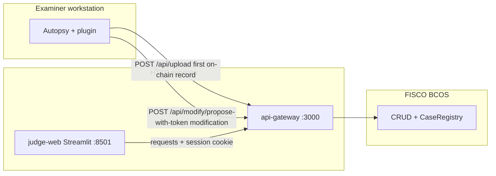

# Autopsy Case Data Extract Plugin

A plugin for Autopsy 4.22.x that extracts forensic audit data from a case and
exports it as a structured JSON report. It also provides a live status window
that monitors plugin activity and verifies image-file integrity on every case open.

---

## Features

- **Case metadata** — Case ID, examiner name, case open/close timestamps
- **Operation log** — Automatically records every significant case event
  (data source added, report generated, case details changed, etc.) with
  timestamps and the active examiner; persisted to `case_extract_events.json`
  in the case directory
- **Data source hashes** — Path, MD5, and SHA-256 for every image/logical
  data source as stored by Autopsy
- **Full file listing** — Name, path, size, timestamps, allocation status,
  known status, MIME type, MD5, and SHA-256 for **every** file inside the
  image (allocated, unallocated, deleted, carved)
- **Aggregate SHA-256** — A single hash covering all of the above, for
  end-to-end integrity verification of the exported report
- **Image integrity check** — On every case open the plugin rehashes the
  physical image file(s) in a background thread and compares the result
  against the last exported report; the status window highlights any mismatch
  as a potential tampering warning
- **Blockchain upload (optional)** — After the JSON report is saved, the module
  can `POST` the export to **api-gateway** (`/api/upload`) with a police token;
  results are written to `upload_receipt.json`, appended to the main JSON as
  `uploadStatus`, and shown in **Case Data Extract Status → Upload Status**
- **Modification proposal (optional)** — For cases already on **CaseRegistry**,
  enable **Submit as modification proposal** in settings (mutually exclusive with upload);
  the module calls **`POST /api/modify/propose-with-token`** and writes **`proposal_receipt.json`**.
  After a judge **approves** on **judge-web**, the gateway **auto-executes** the proposal (no police `execute` step).

---

## Requirements

| Component | Version |
|-----------|---------|
| Java | 17 |
| Autopsy | 4.22.1 (other 4.x may work) |
| OS | Windows 10 / 11 (build scripts are `.bat`) |

---

## Build

The plugin is embedded directly into Autopsy's core module JAR via a patch
script (standard NetBeans NBM installation is blocked by Autopsy's custom
module loader).

```powershell
# From the project root — no additional tools required
build-patch-core.bat
```

What the script does:
1. Compiles all Java sources against Autopsy's bundled JDK and classpath
2. Extracts the original `org-sleuthkit-autopsy-core.jar`
3. Injects the plugin classes and service/layer registrations
4. Repackages the JAR, preserving the original `MANIFEST.MF`

Output: `patch\org-sleuthkit-autopsy-core-patched.jar`

> **Note** — `patch\core.jar` (the original Autopsy core JAR) is excluded
> from version control. Copy it from your Autopsy installation:
> `C:\Program Files\Autopsy-4.22.1\autopsy\modules\org-sleuthkit-autopsy-core.jar`

---

## Usage

### Status window

Open via **Window → Case Data Extract Status** or the toolbar button (same
row as Keyword Search).

**Operations Log tab** — live table of every recorded case event with
timestamp, action type, examiner, and detail.

**Image Integrity tab** — one row per image data source showing:

| Column | Description |
|--------|-------------|
| Image | Data source name |
| File Path | Physical path on disk |
| Status | `Checking… X%` → `OK — integrity verified` or `TAMPERED — hash mismatch!` |
| File SHA-256 (computed) | Fresh hash of the physical file bytes |
| Reference SHA-256 (report) | SHA-256 from the last exported report (or DB hash if no report exists yet) |

The hash computation runs in a background thread; the table updates
automatically every 2 seconds until complete.

---

## Repository components

End-to-end integrity stack bundled in this repository:

| Module | Path | Role |
|--------|------|------|
| Autopsy plugin | `src/.../caseextract/` | Case export, file hashes, aggregate hash |
| API gateway | `api-gateway/` | HTTP façade — upload, query, two-party modify, audit (`:3000`) |
| Data Presentation Dashboard | `judge-web/` | Streamlit UI for judges/auditors — HTTP to gateway only (`:8501`) |
| Blockchain + WeBASE helpers | `blockchain/`, `blockchain-setup/` | FISCO BCOS SDK, chain scripts, optional WeBASE |
| Automated checks | `tests/` | Gateway smoke tests, HAR recorder |



*(Solid edges: Autopsy **upload** and **propose-with-token** are implemented in the report module; judge-web is HTTP-only to the gateway; after **approve**, the gateway executor auto-**executes** on-chain — see `docs/evidence/autopsy-upload/proposal-flow/`.)*

### Generating a report

1. Open a case in Autopsy and complete any desired analysis
2. **Tools → Generate Report**
3. Select **Case Data Extract Report**
4. Choose an output directory and click **Generate**

The report is written to:
```
<case dir>/Reports/<run label>/CaseDataExtract/case_data_extract.json
```

### Blockchain upload from Autopsy

When **upload** is enabled in the report module settings and a valid **gateway URL**
and **OTP** are supplied, the plugin uploads the freshly written JSON to
**api-gateway** and records:

| Output | Location |
|--------|----------|
| Gateway receipt (timing, `requestId`, tx hashes, …) | `.../CaseDataExtract/upload_receipt.json` |
| Upload summary on the main report | `uploadStatus` / `uploadDetail` at end of `case_data_extract.json` |
| Monitor snapshot | **Window → Case Data Extract Status → Upload Status** |

### Modification proposal (judge approval + auto-execute)

When **Submit as modification proposal** is enabled (mutually exclusive with upload), the plugin calls **`POST /api/modify/propose-with-token`** and writes:

| Output | Location |
|--------|----------|
| Proposal receipt | `.../CaseDataExtract/proposal_receipt.json` |

After the judge **approves** on the dashboard, the gateway **automatically** runs **`execute`** (executor account); the police do not call `execute` from Autopsy. Verification: `GET /api/modify/<proposalId>` → `Executed`; `POST /api/query` → CRUD/registry consistent.

**Evidence pack:** `docs/evidence/autopsy-upload/proposal-flow/` (P4 checklist, samples, screenshot placeholders).

**Thesis / evidence pack:** `docs/evidence/autopsy-upload/` (`mapping.md`, `proposal-flow/`, `samples/`, `screens/`).

**Deploy the plugin on Autopsy 4.22.x:** use the **core JAR patch** (`build-patch-core.bat` → run **`install-patch-core.bat`** as Administrator), not the standard NBM-only flow — see `.cursor/rules/autopsy-core-patch-deployment.mdc`.

**Report structure:**
```json
{
  "caseId":        "...",
  "examiner":      "...",
  "generatedAt":   "2026-03-06 00:01:34",
  "dataSources": [ { "name": "...", "paths": [...], "md5": "...", "sha256": "..." } ],
  "operations":  [ { "time": "...", "type": "CASE_OPENED", "operator": "...", "detail": "..." } ],
  "files":       [ { "name": "...", "path": "...", "size": 0, "md5": "...", "sha256": "..." } ],
  "aggregateHash": "...",
  "aggregateHashNote": "SHA-256 of the report body with aggregateHash field zeroed"
}
```

The `aggregateHash` is the SHA-256 of the entire report body (UTF-8) with
the `aggregateHash` and `aggregateHashNote` fields set to empty strings, so
any change to any part of the report invalidates it.

---

## Project structure

```
src/
  org/sleuthkit/autopsy/report/caseextract/
    CaseEventRecorder.java                  # Case event listener, operation log,
    │                                       # image integrity check engine
    CaseDataExtractMonitorTopComponent.java # Status window (TopComponent)
    OpenCaseDataExtractMonitorAction.java   # Toolbar / menu action to open the window
    CaseDataExtractReportModule.java        # GeneralReportModule — JSON report export
    Bundle.properties                       # UI strings
  META-INF/
    MANIFEST.MF
    services/org.sleuthkit.autopsy.report.GeneralReportModule
  org/.../caseextract/resources/
    layer.xml                               # NetBeans layer — menu/toolbar registration

install-config/
  core-layer-patched.xml                   # Patched Autopsy core layer.xml
  core-GeneralReportModule-services.txt    # Service registration injected into core JAR

patch/                                     # Build working directory (gitignored except scripts)
build-patch-core.bat                       # Main build script
INSTALL-AS-ADMIN.bat                       # Installation script (requires Administrator)
clear-cache-and-restart.bat                # Utility: clear NetBeans cache
```

---

## Viewing Autopsy logs (troubleshooting)

1. **Menu**: Autopsy → **Help → Open Log Folder**
2. **Manual path**: `%APPDATA%\autopsy\var\log`
3. Key files:
   - `autopsy.log.0` — main application log
   - `messages.log` — detailed startup and module loading info
4. Search for `caseextract`, `SEVERE`, or `Exception` to locate plugin-related errors

---

## Notes on image format compatibility

| Format | File hash vs. DB hash | Integrity check |
|--------|-----------------------|-----------------|
| Raw (`dd` / `img`) | Identical — both cover the same bytes | Fully supported |
| EnCase (`E01`) | Different — DB hash is the logical disk content; file hash is the E01 container | Use **report** as reference (generate once, verify on subsequent opens) |

For best results with any format: generate a report immediately after adding
a data source, then use the Image Integrity tab on all subsequent case opens.

---

## Blockchain Module (Case Data Integrity)

The project includes a **blockchain module** for storing case data hashes on a FISCO BCOS chain, providing tamper-evident integrity verification.

### Overview

| Component | Description |
|-----------|-------------|
| `blockchain/` | Java SDK module — hash computation, private store, chain write/query |
| `blockchain-setup/` | Setup scripts — WSL, FISCO BCOS 4-node chain, WeBASE |

### Hash-Only Storage

Only hashes are stored on chain; full case records remain in private off-chain storage (`~/.case_record_store.json`). WeBASE and chain queries see only hashes, not plaintext.

- **index_hash** = SHA256(case_id) — primary key for lookup
- **record_hash** = SHA256(full record) — integrity verification

### Two-Party Modification

Modifications require **police proposal + court approval**. Only after both agree can the police execute the update. See `blockchain-setup/TWO-PARTY-MODIFICATION.md`.

### Quick Start

1. **Setup chain** (WSL): `bash blockchain-setup/2-setup-fisco.sh`
2. **Create table** in console: `create table t_case_hash(index_hash varchar, record_hash varchar, primary key(index_hash))`
3. **Generate insert** from Java: `cd blockchain && mvn exec:java -Phash-only`
4. **Optional WeBASE**: `bash blockchain-setup/3-setup-webase.sh` → http://localhost:5000

See `blockchain/README.md` and `blockchain-setup/README.md` for details.

---

## Central API Gateway (Node) & Phase 2 contract

The repository includes **`api-gateway/`** — an HTTP gateway that:

- uploads case hashes (`POST /api/upload`) to FISCO **`t_case_hash`** and, by default with **`CHAIN_MODE=contract`**, **`CaseRegistry`** (`createRecord` needs **`signingPassword`**);
- runs the **two-party** flow (`/api/modify/*`) against **`CaseRegistry.sol`**;
- appends contract events to **`data/audit.jsonl`** and exposes **`GET /api/audit`** (judge session).

**Full setup (clean machine):** follow **`api-gateway/README.md`** end-to-end: Node 18+, `npm install`, `.env` from **`.env.example`**, `npm run compile`, `npm run deploy-contract`, `npm run seed-users`, `npm run seed-roles`, `npm run dev`.

**Dissertation evidence (Phase 9):** **`docs/evidence/`** — ABI copy, CSVs of negative tx hashes, HTTP samples, **chapter → evidence** mapping (`chapter-evidence-mapping.md`), WeBASE screenshot checklist (`docs/evidence/webase/README.md`). Regenerate the ABI copy after contract changes (see `docs/evidence/README.md`).

**Implementation log (CN):** **`docs/project-progress.md`** — incident notes (e.g. Judge Query CRUD vs CaseRegistry alignment, `/api/query` hardening).

---

## Data Presentation Dashboard (Streamlit, port 8501)

The **judge-web** app is a Python + Streamlit dashboard for **judges and auditors**. The browser talks only to Streamlit; the Streamlit process calls **api-gateway** with `requests` and holds the judge session cookie server-side (no blockchain SDK in the browser).

**Quick start:** see **`judge-web/README.md`** — create a venv, `pip install -r judge-web/requirements.txt`, copy `judge-web/.env.example` to `.env`, set `API_GATEWAY_URL`, then `python -m streamlit run app.py` inside `judge-web/`.

**Thesis / appendix evidence** (screenshots, sample verification reports, HAR): **`docs/evidence/judge-web/`** (`mapping.md`, `samples/`, `screens/`, `network/`). Regenerate placeholders and JSON/PDF samples with `python docs/evidence/judge-web/build_evidence_artifacts.py` after `pip install -r docs/evidence/judge-web/requirements-build.txt`.

**Regression:** with gateway running, `python -m pytest tests/smoke.py -v` from the repo root.

---

## License

This plugin is provided for research and academic use. It is independent of
and not affiliated with the Autopsy or Sleuth Kit projects. Refer to the
[Autopsy](https://www.sleuthkit.org/autopsy/) and
[Sleuth Kit](https://www.sleuthkit.org/) license terms before redistribution.
