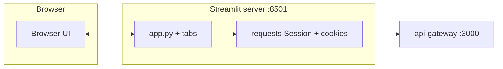

# Judge Web — Data Presentation Dashboard (Streamlit)

Python + Streamlit dashboard for judges and auditors. It talks to **api-gateway** over HTTP only (no blockchain SDK in the browser). The browser connects to **Streamlit** (`:8501`); the Streamlit server holds the judge session cookie and calls `API_GATEWAY_URL`.

## Prerequisites

- Python **3.11+** (3.13 tested)
- Running **api-gateway** (default `http://127.0.0.1:3000`) with judge accounts seeded
- Optional: FISCO / `CHAIN_MODE=contract` for full query + modify + audit behaviour

## Quick start

```powershell
cd judge-web
python -m venv .venv
.\.venv\Scripts\Activate.ps1
pip install -r requirements.txt
copy .env.example .env
# Edit .env: API_GATEWAY_URL=http://127.0.0.1:3000
python -m streamlit run app.py
```

Open **`http://127.0.0.1:8501`** (or the URL printed in the terminal). Streamlit is configured with **`server.headless = true`** in `.streamlit/config.toml` so the dev server does not auto-open a browser tab.

## Architecture



## Integration tests (gateway HTTP)

Repository root **`tests/`** (not inside `judge-web/`):

- **`tests/smoke.py`** — pytest + requests against api-gateway (Phase 6 S6.2)
- **`tests/record_gateway_har.py`** — Playwright HAR of `/login`, `/api/query`, `/api/modify/*`, `/api/audit` (Phase 6 S6.3)

See **`tests/README.md`** and **`docs/evidence/judge-web/network/README.md`**.

## Debugging

- **Session / login loop**: The gateway cookie mirror lives in Streamlit `session_state`. If you restart Streamlit, log in again. If the gateway returns **401** on probe, the app returns to the login form.
- **`st.rerun()` / widget state**: After forms that call `st.rerun()`, avoid writing to `session_state` keys that are bound to widgets **after** the widget is instantiated in the same run; use a pending key consumed **before** the widget (see `workspace_state.py`).
- **Lost cookies**: Only `session_state` is persisted across reruns; a Streamlit **server** restart clears sessions — users must log in again.
- **`127.0.0.1` vs `localhost`**: Use the same host in `.env` as in the browser to avoid cookie / CSRF confusion.
- **Chain / 503**: Judicial and query tabs need a configured gateway (`CASE_REGISTRY_ADDR`, certs) for contract mode.

## Clean machine checklist (with smoke)

1. Start **api-gateway** per `api-gateway/README.md` (`npm run dev`, seeded judge + police users).
2. Create **`tests/smoke_config.json`**: `python tests/seed_fixtures.py --prepare-smoke` (see `tests/README.md`).
3. `python -m pytest tests/smoke.py -v` — all green against `:3000`.
4. In another terminal: `cd judge-web`, venv, `pip install -r requirements.txt`, `python -m streamlit run app.py`.
5. Open `:8501`, log in as judge, exercise Query → Judicial Review → Audit Trail.

## Known limitations (Phase 6 S6.4 — browsers)

Manual smoke on **Google Chrome** and **Microsoft Edge** (same machine, same gateway + optional same Streamlit build):

| Area | Chrome | Edge | Notes |
|------|--------|------|--------|
| Streamlit WebSocket / `_stcore/stream` | Supported | Supported | Corporate proxies that block WebSockets may break live reruns; use a direct connection or allowlist `localhost`. |
| `st.download_button` (JSON / PDF reports) | Native download bar | Native download bar | Allow downloads for the site; Edge may show “Save as” in a different corner — behaviour is OS-dependent. |
| Session refresh | Full page reload keeps Streamlit state until server restart | Same | Restarting `streamlit run` clears server-side session; re-login required. |
| Automated HTTP regression | N/A | N/A | Use **`python -m pytest tests/smoke.py -v`** for gateway contracts; browsers are for UI sanity checks only. |

**S6.4 checklist (manual):** Log in as judge → **Query** (verify + optional downloads) → **Judicial Review** (fetch / decide if you have pendings) → **Audit Trail** (table + refresh). Repeat in the second browser. Record any difference under a short note in your dissertation appendix or issue tracker.

## Dissertation / evidence

Thesis pack root: **`docs/evidence/judge-web/`**.

- **`mapping.md`** — chapter → file mapping (screens, samples, HAR).
- **`samples/`** — `verification_report.json` / `.pdf`; validate JSON with `python docs/evidence/judge-web/verify_sample.py`.
- **`screens/`** — PNG checklist in `screens/README.md` (replace placeholders for the final dissertation).
- **`network/`** — `approve-flow.har` (gateway REST); see `network/README.md` for regeneration and redaction.
